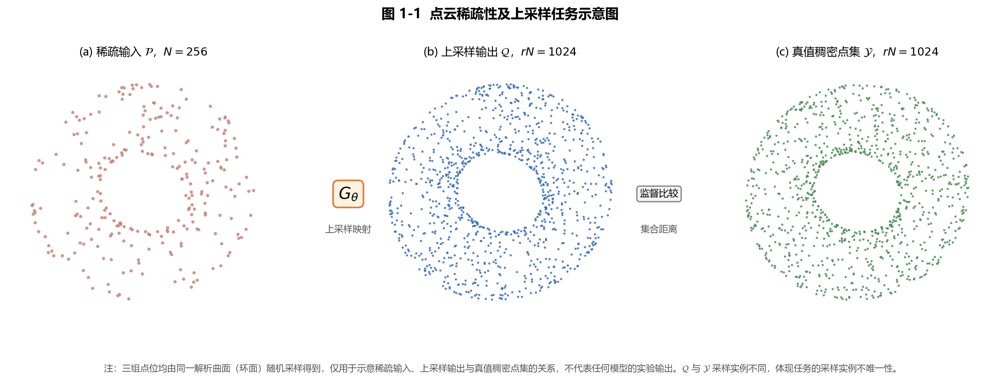
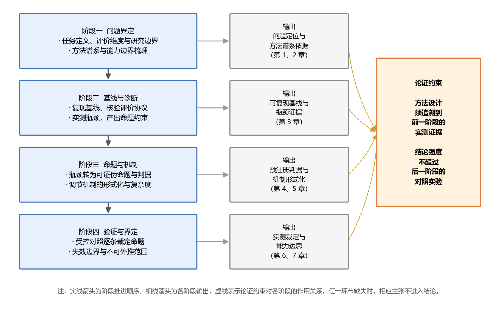
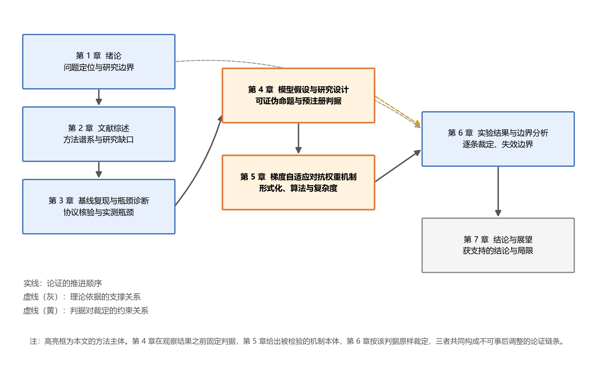

# 第1章 绪论

## 1.1 研究背景

### 1.1.1 三维点云的采集、表达与稀疏性

三维点云以离散坐标记录物体表面或场景空间中的采样位置。与规则图像不同，点集没有固定的像素邻接关系，也不携带天然顺序；与体素表示相比，点云不必先把连续空间离散为规则网格，能够以较低的空体素开销保存局部几何。PointNet 以逐点共享映射和对称聚合处理置换不变性{{cite:PointNet}}，PointNet++ 进一步用分层邻域组织局部几何{{cite:PointNet2}}，这些工作奠定了直接处理点集的技术基础。此后，点云被广泛用于三维检测{{cite:VoxelNet}}{{cite:PointRCNN}}、定位建图{{cite:LOAM}}、表面重建{{cite:PoissonRecon}}和形状理解{{cite:PointCloudSurvey}}。

点云可以由激光雷达、结构光、飞行时间相机和多视图重建等方式获得。无论采用哪一种传感机制，观测都受角分辨率、视点、遮挡、反射特性、距离和噪声制约。稀疏性因此不只是“点数较少”，还表现为不同区域的采样密度不一致、物体边缘和薄结构观测不足以及局部孔洞。以激光扫描为例，固定角分辨率会使远处目标的相邻采样间距扩大；遮挡又会使背向传感器的表面缺少观测。由此得到的点云不是连续表面的完整记录，而是受物理采样过程限制的有限证据。

有限采样会影响后续几何处理。球旋转重建要求球半径与采样间距相匹配{{cite:BallPivoting}}；屏蔽泊松重建依赖点的位置与法向信息恢复隐式表面{{cite:PoissonRecon}}；移动最小二乘方法则在局部邻域拟合曲面{{cite:MLS}}。当邻域观测不足时，局部切平面、法向量和曲率的估计会更依赖先验假设。对于以边缘点和平面点建立约束的定位方法或以前景点形成候选框的检测方法，观测密度同样决定模型能够利用多少几何证据{{cite:LOAM}}{{cite:PointRCNN}}。这些事实说明，增密点云的价值不在于机械地增加坐标数量，而在于能否在不伪造几何的前提下补充可用的表面采样。

点云上采样正是在这一背景下形成的研究任务。给定稀疏输入点集，算法生成点数更多的输出点集，并希望输出点既接近潜在表面，又具有合理的局部分布。传统方法通过投影、重采样或局部几何优化实现增密{{cite:LOP}}{{cite:WLOP}}{{cite:EAR}}；深度方法则从训练数据中学习局部形状和点分布先验{{cite:PUNet}}{{cite:MPU}}{{cite:PUGAN}}{{cite:PUGCN}}{{cite:PUTransformer}}。两类方法共同面对一个基本约束：输入中没有被观测到的几何不能由算法无条件恢复，任何新增点都包含某种先验推断。

图 1.1 点云稀疏性、重建度量与训练调节的问题链

### 1.1.2 点云上采样方法的技术演进

早期点集增密主要依靠曲面拟合、投影和均匀化。LOP 以参数化无关的投影方式整理点集{{cite:LOP}}，WLOP 在投影过程中兼顾点的吸引与排斥以改善分布{{cite:WLOP}}，EAR 则面向锐利边缘进行重采样{{cite:EAR}}。这些方法的优势是几何机制清楚、无需大规模训练数据；局限是参数和局部模型需要适配不同表面，面对复杂形状时表达能力受到手工先验约束。

PU-Net 将点云上采样转化为端到端学习问题，以分层特征提取和多分支扩张生成稠密点集，并通过重建和均匀性损失训练{{cite:PUNet}}。MPU 使用逐级上采样降低一次性高倍率生成的难度{{cite:MPU}}。PU-GAN 引入判别器和自注意力，使输出点集除受重建损失约束外，还接受分布级真假判别{{cite:PUGAN}}。PU-GCN 以图卷积组织局部关系{{cite:PUGCN}}，PU-Transformer 以通道偏移多头注意力在计算成本与特征交互之间折中{{cite:PUTransformer}}。随后，任意倍率网络{{cite:MAFU}}{{cite:Grad-PU}}{{cite:SAPCU}}、流模型{{cite:PUFlow}}、扩散模型{{cite:PUDM}}和核点表示{{cite:RepKPU}}进一步扩展了方法谱系。

技术演进带来了更强的表达能力，也增加了训练目标的复杂度。一个典型上采样系统可能同时包含 Chamfer 重建损失、均匀性损失、排斥损失和对抗损失。各损失衡量不同质量维度，它们的数值量纲、下降速度和梯度方向并不必然一致。若把若干损失简单相加，固定系数就承担了两种职责：一是表达研究者希望各目标具有怎样的相对重要性，二是补偿不同损失在当前训练阶段的梯度尺度差异。前一职责可以是固定偏好，后一职责却可能随训练改变。

### 1.1.3 从性能比较转向训练机制测量

大量方法论文以最终 CD、HD、P2F 或 NUC 作为主要比较对象，这种比较对于判断输出质量不可缺少，但不能单独解释训练为什么得到该结果。尤其在对抗训练中，最终指标由生成器、判别器、损失权重、更新频率和训练阶段共同决定。某一配置比另一个配置更好，既可能来自判别器提供了有效分布信号，也可能只是一个固定权重在特定阶段恰好合适。

多任务学习研究提供了另一种观察角度。GradNorm 直接根据任务梯度调整损失权重{{cite:GradNorm}}；不确定性加权把任务噪声写入可学习权重{{cite:UncertaintyWeighting}}；DWA 根据损失下降速率分配权重{{cite:DWA}}；PCGrad、CAGrad 和 Nash-MTL 分别从梯度冲突、共同下降和议价博弈角度处理多目标更新{{cite:PCGrad}}{{cite:CAGrad}}{{cite:NashMTL}}。更直接地，Taming Transformers/VQGAN 的官方实现已经使用重建梯度范数与对抗梯度范数之比动态设置判别损失权重{{cite:TamingTransformers}}。这说明动态判别权重不是本文凭空产生的想法，而是一类已有训练机制。

本文据此把研究重心从“再增加一个结构模块”转向“测量和调节训练中的梯度关系”。这种转向并不预设动态方法一定更好。相反，只有把无对抗、固定对抗、自适应对抗和显式均匀性约束放在受控实验中，动态权重的真实收益和失败条件才会显现。

## 1.2 问题提出和研究定义

### 1.2.1 问题提出

本文首先追问：**低 Chamfer 距离是否必然代表高质量的上采样点云？** Chamfer 距离以双向最近邻距离的均值度量两个点集的接近程度{{cite:PointSetGen}}。若多个输出点聚集在少数正确位置附近，这些点到真值的最近邻距离仍可很小；局部空洞造成的惩罚又会被全体点的均值稀释。密度感知 Chamfer 距离的提出也反映了传统 Chamfer 对密度差异的描述不足{{cite:DensityAwareCD}}。因此，重建目标较低并不逻辑蕴含点间距均匀。

第二个问题是：**为什么考虑对抗监督？** 判别器不要求生成点与真值点一一对应，而是学习区分真实点集 patch 和生成 patch 的分布特征。它有可能捕捉单纯最近邻均值没有充分惩罚的聚簇模式。PU-GAN 正是沿这一思路把对抗学习引入点云上采样{{cite:PUGAN}}。然而，“能够提供不同信号”不等于“加入后必然提升”。如果对抗梯度过强，生成器可能牺牲几何保真；如果过弱，判别器几乎不影响更新。

第三个问题是：**一个固定权重能否在整个训练期持续表达同样的相对作用？** 设重建损失和对抗损失分别为 $\mathcal{L}_{\mathrm{rec}}$ 与 $\mathcal{L}_{\mathrm{adv}}$，固定权重训练目标为

$$
\mathcal{L}_{G}
=\mathcal{L}_{\mathrm{rec}}
+\lambda_{\mathrm{adv}}\mathcal{L}_{\mathrm{adv}} . \tag{1.1}
$$

生成器参数上的实际更新不由损失标量本身决定，而由梯度决定：

$$
\nabla_{\theta}\mathcal{L}_{G}
=\nabla_{\theta}\mathcal{L}_{\mathrm{rec}}
+\lambda_{\mathrm{adv}}\nabla_{\theta}\mathcal{L}_{\mathrm{adv}} . \tag{1.2}
$$

式（1.1）中，$\lambda_{\mathrm{adv}}$是固定对抗权重；式（1.2）说明，真正作用于生成器参数$\theta$的是两条梯度而不是两个损失标量。若两条梯度范数之比随训练改变，固定的$\lambda_{\mathrm{adv}}$对实际更新方向和幅值的作用也会改变。由此形成本文的核心问题：在已经采用对抗训练的条件下，按梯度范数动态设置权重，能否比项目预设固定权重更少地破坏输出点分布？

第四个问题是：**即使动态权重优于一个固定值，它是否优于无对抗训练和直接均匀性约束？** 这个反问决定了实验不能只比较 B1 与 B2。无对抗 baseline 检验“对抗分支是否值得引入”；B1 与 B2 检验“引入后如何赋权”；C1 则检验是否可用直接 uniform loss 更有效地约束点分布。四组缺一不可。

最后一个问题是：**本文究竟补充了什么？** Taming Transformers/VQGAN 已有梯度范数比动态判别权重{{cite:TamingTransformers}}。因此本文不把基本比值公式作为首创，而把贡献限定为点云上采样场景中的梯度测量、参数作用域和目标比值适配、与直接均匀性约束的受控比较，以及正负边界的完整报告。

### 1.2.2 研究的定义

给定稀疏点云

$$
\mathcal{P}=\{\mathbf{p}_i\}_{i=1}^{N},\qquad
\mathbf{p}_i\in\mathbb{R}^{3}, \tag{1.3}
$$

式（1.3）中，$N$为输入点数，$\mathbf p_i$为第$i$个三维坐标。给定上采样倍率$r$，生成器$G_{\theta}$输出

$$
\mathcal{Q}=G_{\theta}(\mathcal{P})
=\{\mathbf{q}_j\}_{j=1}^{rN}. \tag{1.4}
$$

式（1.4）中，$\mathcal Q$为输出点集，点数为$rN$。本文限定$r=4$，训练与验证数据来自 PU1K，生成骨干为本文复现的 PU-Transformer，判别器为按 PU-GAN 思路实现的点云判别器。baseline 只使用重建目标，不构建判别器；B1 构建判别器并使用固定权重 8.27；B2 使用梯度自适应对抗权重；C1 不使用判别器而加入显式均匀性损失。B1 的 8.27 在当前证据状态下只称为“项目预设固定对照值”，因为早期材料所称的 B-001 离线测量记录尚未恢复。

本文关注三类结果。第一类是几何保真，包括 CD 与 HD；第二类是输出点分布，包括最近邻距离变异系数 $\mathrm{cv}_{\mathrm{nn}}$ 与稀疏四分位统计；第三类是训练机制与代价，包括动态权重、梯度范数和训练时间。NUC 与 P2F 只有在正式测试协议和原始产物可用时进入主表，当前仓库没有这些证据，因而不填造这两项。

研究范围还包含四项明确限制。其一，旧补测的200条记录中有189条来自训练划分，只有11条与真实验证划分相交，故200条结果只能作训练内诊断，11条交集也只能作探索性核对。其二，各实验批次只相对本批次复现基线比较，不把独立训练批次的绝对值混作直接方法差。其三，当前主要配置只有seed=20260811，跨样本不确定性不能替代跨seed训练重复。其四，本文不研究任意倍率、真实场景端到端部署或所有生成器—判别器组合，结论不能外推到这些范围。

## 1.3 研究的意义

### 1.3.1 理论意义

本文的理论意义首先体现在把“损失权重”还原为“梯度贡献”。在多损失训练中，标量损失的数量级不是参数更新的充分描述；同一权重在不同层、不同 epoch 和不同参数范围上可能产生不同的梯度贡献。通过在共同参数上测量重建与对抗梯度，本文把固定权重是否持续表达目标比例转化为可观察问题。

第二，本文把点云质量的多维性与优化过程连接起来。CD 关注集合接近程度，HD 关注最坏偏差，$\mathrm{cv}_{\mathrm{nn}}$ 关注点间距离散，判别器学习分布级信号，uniform loss 直接施加局部分布约束。它们不是同一质量概念的重复表达。把这些指标和训练分支放入同一分析框架，有助于解释“某个损失改善一项指标却损害另一项指标”的现象，而不是把所有变化笼统称为性能提升。

第三，本文以一个负面边界检验动态权重的真实含义。如果 B2 相对 B1 改善而仍不及 baseline，那么能够成立的结论是“缓解特定固定权重退化”，而不是“对抗训练优于无对抗训练”。这种区分有助于避免把局部对照优势升级为总体方法优势。

### 1.3.2 现实意义

固定损失权重通常需要多次试验。若不同训练阶段的梯度尺度变化明显，单次调出的系数可能只适合一段训练过程。动态权重的工程价值在于减少某类尺度补偿的人工搜索，并把训练监控从损失曲线扩展到实际梯度贡献。不过，本文现有实现需要对两条损失分别调用自动求导，计算开销不能忽略；是否值得采用必须与实际收益一起报告。

本文还强调实验可审计性。每个结果都应能从配置、环境、checkpoint、逐样本测量和统计脚本回溯。对于点云上采样这类评价协议容易混淆的任务，明确训练监控与正式评价的不同归一化口径、明确训练seed与验证样本的统计层级、保存失败实验，能够降低无法复现和选择性报告的风险。

最后，直接 uniform loss 在当前实验中表现为强竞争基线。这一结果为工程选择提供了更现实的判断：如果目标主要是改善点分布，简单直接的约束可能比计算成本更高的动态对抗训练更合适；若仍选择对抗分支，就应说明它提供了哪种无法由直接约束替代的收益。

## 1.4 技术路线和研究内容

### 1.4.1 技术路线

本文按照“先定义问题，再测量问题，随后设计方法，最后限制结论”的顺序推进。

图 1.2 全文技术路线与证据闭环

第一阶段为文献与协议核验。通过 arXiv、Crossref、DBLP、OpenAlex 和官方代码核对点云上采样、对抗训练和动态加权文献；同时读取 PU-Transformer 与 PU-GCN 的原始实现材料，明确训练损失和正式评价协议。

第二阶段为基线构建与问题测量。复现 PU-Transformer 生成器，核对参数量、张量形状和数据流；用极端对照校准指标方向；在固定样本上测量 CD 双向分量、最近邻间距、稀疏四分位和相关性，并通过真实验证交集核对问题是否仍然可见。

第三阶段为研究设计与方法适配。将动态权重写成可证伪假设，明确 baseline、B1、B2 和 C1 的控制变量；在生成器共同参数上测量两条梯度，按目标比值计算自适应权重，并与线性 ramp 组合。

第四阶段为结果裁定与边界分析。主比较只在同一实验批次、同seed和同一抽样口径内进行；同时报告CD、HD与$\mathrm{cv}_{\mathrm{nn}}$；把训练内诊断、真实验证交集与跨seed训练重复分开；保留失败消融、计算代价和未完成实验。最终结论只接受能够回指证据文件的内容。

### 1.4.2 研究内容

围绕上述路线，本文开展四项研究工作。

1. **建立可复查的分析框架。** 统一点云上采样任务定义、基线结构、数据流、训练监控、正式评价与证据等级，形成从原始数据到文字主张的追溯链。
2. **测量基线的局部点分布现象。** 审计固定样本的训练/验证归属，在真实验证交集上比较预测与真值最近邻距离变异系数，并结合双向Chamfer分量和稀疏分层描述问题。
3. **适配梯度自适应对抗权重。** 继承 VQGAN 动态判别权重的基本思想，在点云生成器全部可训练参数上测量梯度，引入目标比和线性 ramp，形成 GAAW 训练流程。
4. **用核心四组实验验证收益和边界。** baseline 回答是否需要对抗；B1 与 B2 回答固定和动态赋权的差异；C1 提供直接均匀性约束竞争方案；其他消融用于识别不能成立的设计推断。

## 1.5 研究问题与主要工作

### 1.5.1 研究问题

全文集中回答三个问题。

- **RQ1：** 在本文的点云上采样对抗训练设置中，重建梯度与对抗梯度的相对尺度是否随训练阶段变化？
- **RQ2：** 当对抗训练已经启用时，GAAW 能否相对固定权重 8.27 缓解几何或点分布退化？
- **RQ3：** GAAW 相对无对抗基线、直接均匀性损失和已有动态加权先例的收益、代价与适用边界是什么？

表 1.1 给出研究问题、证据和推论范围。表中“当前状态”只是写作时点的证据快照，最终论文应在补充实验后更新。

表 1.1 研究问题、证据与推论范围

| 研究问题 | 主要证据 | 当前状态 | 当前不能推出 |
|---|---|---|---|
| RQ1 梯度尺度是否变化 | B2 原始梯度和权重轨迹 | 原始 trace 待恢复 | 不能用文字记录替代原始轨迹 |
| RQ2 B2 是否优于 B1 | 同批次同seed的B1/B2逐样本CD、HD、cv_nn | cv_nn探索性方向支持；CD/HD恶化 | 不能推出多指标优越、跨seed稳健或所有固定权重均更差 |
| RQ3 相对其他方案的边界 | baseline/B1/B2/C1，消融与成本 | B2 四项未超过 baseline；C1形成另一种权衡 | 不能推出总体性能提升或 SOTA |

### 1.5.2 主要工作

本文主要工作概括为“测量、适配、验证和界定”。

1. **测量与诊断。** 构建当前 PU-Transformer 复现基线，使用逐样本最近邻统计、双向 Chamfer 分解和稀疏分层描述局部点分布问题。
2. **场景适配。** 将已有梯度范数比动态判别权重思想适配到 PU-Transformer/PU-GAN 联合训练，明确参数作用域、目标比值、稳定项和 ramp。
3. **受控验证。** 组织baseline、B1、B2和C1核心对照，按实验批次及对应基线报告结果，使用配对样本描述固定模型差异，并把多seed作为独立待补证据。
4. **边界分析。** 主动报告B2未超过无对抗基线、C1呈现不同指标权衡、若干消融失败和训练成本，避免把条件性收益扩大为普遍结论。

这些工作是否构成最终“创新点”，取决于多 seed、敏感性和标准动态加权直接对照是否补齐。当前稿件使用“主要工作”而不是“重大创新”作为章节标题。

## 1.6 论文组织结构

全文共七章，章节承接关系如图 1.3 所示。

图 1.3 七章问题、方法与证据承接关系

第 1 章提出研究初衷、问题、定义、意义和技术路线。第 2 章按点云上采样、生成式监督和动态损失加权三条线索综合已有研究，特别说明 VQGAN 直接先例。第 3 章建立质量目标、基线系统、评价协议和证据追溯的分析框架。第 4 章把问题转化为研究假设、变量和对照设计，明确统计单位与效度威胁。第 5 章给出 GAAW 的公式、训练流程、灵感来源、复杂度和原创性边界。第 6 章报告基线诊断、核心比较、消融、机制测量、计算成本和失败边界。第 7 章逐一回答研究问题，总结可确认工作、局限与未来方向。

## 1.7 本章小结

本章从点云采样的物理限制出发，说明点云上采样要解决的不是简单“补点”，而是在有限观测下生成接近潜在表面且分布合理的点集。通过连续反问，本章把研究问题从“是否需要更复杂网络”收窄为“在已经采用对抗训练时，固定权重是否持续表达预期的梯度贡献，以及动态权重能够缓解什么退化”。

本章进一步限定了研究范围：PU1K、4倍上采样、本文复现的PU-Transformer生成器、PU-GAN风格判别器以及按实验批次和seed组织的受控比较。动态梯度比存在VQGAN直接先例，本文只把点云场景的测量、适配、验证和边界分析作为工作内容。最后，技术路线明确了从文献、代码和原始数据到实验主张的证据闭环，并把baseline、B1、B2和C1确定为核心比较。下一章将从文献中进一步回答各方法解决了什么、仍留下什么问题以及本文继承了哪些思想。
