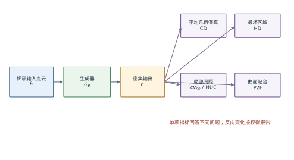
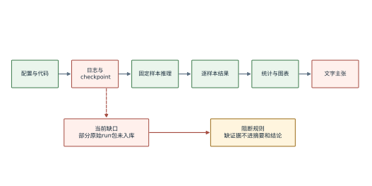
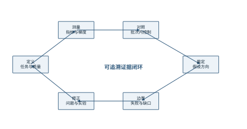
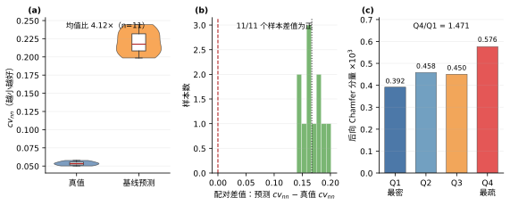

# 第3章 点云上采样的分析框架

第2章说明了点云上采样方法从逐点特征提取、图卷积、注意力建模逐步发展到生成式建模的技术脉络，也指出了本文最需要回避的两个推理捷径：其一，不能把 Chamfer 距离的下降直接等同于点分布质量的全面改善；其二，不能因为对抗学习在其他生成任务中有效，就预先认定它在点云上采样中必然有效。本章据此建立统一的分析框架，将“任务是什么、质量如何分解、证据怎样形成、结论在什么条件下成立”依次形式化。除用于提出问题的固定基线诊断外，本章不裁定方法优劣；其主要输出是第4章研究假设与第5章算法设计共同遵守的测量协议。

## 3.1 点云上采样质量的内涵分析

### 3.1.1 任务输入、输出和潜在曲面的界定

给定由三维扫描或已有模型采样得到的稀疏点集，点云上采样要求在不改变对象几何语义的前提下增加点数。设输入点云为 $\mathcal{P}=\{\mathbf p_i\}_{i=1}^{N}\subset\mathbb R^3$，真值密集点云为 $\mathcal{Y}=\{\mathbf y_j\}_{j=1}^{rN}\subset\mathbb R^3$，生成器 $G_{\theta}$ 的输出记为 $\mathcal{Q}=\{\mathbf q_j\}_{j=1}^{rN}$。本文研究的4倍上采样任务写为

$$
\mathcal{Q}=G_{\theta}(\mathcal{P}),\qquad |\mathcal{Q}|=r|\mathcal{P}|,\qquad r=4 . \tag{3.1}
$$

式（3.1）中，$\theta$ 表示生成器的可训练参数，$N=256$，因而输出点数为1024。这里的等式只规定点数关系，不规定输出点与真值点之间的一一对应。点集的无序性决定了训练目标必须在置换不变的集合度量下建立；PointNet对集合对称函数的分析以及点集生成研究均为这一建模方式提供了基础{{cite:PointNet}}{{cite:PointSetGen}}。

上采样任务还包含一个不可直接观测的对象，即产生输入点云的潜在曲面 $\mathcal S$。理想输出既应靠近 $\mathcal S$，也应在 $\mathcal S$ 上合理铺展。然而，有限的真值点集 $\mathcal Y$ 只是对 $\mathcal S$ 的一次离散采样，不能与连续曲面完全等同。因此，本文把“贴近真值点集”“贴近潜在曲面”和“点在局部区域内分布均匀”区分为三个质量维度。这一区分解释了为什么同一个输出可能具有较低的集合距离，却仍然存在局部聚簇、空洞或离群点。

上述三个对象还对应三种不同的误差来源。输入采样误差来自 $\mathcal P$ 对潜在曲面的稀疏表达，真值离散误差来自 $\mathcal Y$ 对连续曲面的有限采样，模型误差则来自 $G_{\theta}$ 在既定训练目标下产生的偏差。评价时若只比较 $\mathcal Q$ 与 $\mathcal Y$，三类误差会共同进入观测值，因而不能把全部差异都归因于生成器。本文通过固定数据划分、固定验证索引和批次内基线降低前两类误差对方法比较的干扰，但并未消除真值点云自身的采样偏差。由此，论文讨论的始终是既定协议下的相对方法效应，而不是对连续曲面质量的无误差测量。

点数约束也不能替代空间覆盖约束。$|\mathcal Q|=|\mathcal Y|$只保证集合基数相同；即使输出点数完全正确，多个点仍可能聚集在同一局部区域，而另一些区域形成空洞。反过来，局部间距规则也不保证几何位置正确：在错误曲面上均匀铺点，最近邻间距可以非常稳定，却不具备任务所需的几何语义。因此，几何保真与分布规则性不是可以互相推导的两个表述，而是必须同时测量的两个约束轴。

本文的任务边界也由式（3.1）给出。研究对象限定为PU1K数据、固定4倍倍率、PU-Transformer生成器与PU-GAN式判别器的组合，不讨论任意倍率、真实传感器噪声下的端到端部署，也不把现有样本切片上的观察外推到所有类别和扫描条件。任意倍率方法、扩散式方法和真实扫描方法仍是重要方向{{cite:MAFU}}{{cite:Grad-PU}}{{cite:PUDM}}，但它们不属于本研究的因果比较范围。

### 3.1.2 质量目标的内容构成

点云上采样质量至少由几何保真、覆盖完整、局部分布和异常风险四个部分构成。几何保真询问输出点是否靠近真值或曲面；覆盖完整询问真值区域是否都能找到邻近输出点；局部分布询问点间距是否稳定、是否形成聚簇和空洞；异常风险则关注少量最坏点或最坏区域。PU-Net、PU-GAN、PU-GCN和PU-Transformer在网络结构和损失设计上采取了不同方案，但其评价表通常都不能由单一指标替代{{cite:PUNet}}{{cite:PUGAN}}{{cite:PUGCN}}{{cite:PUTransformer}}。

为避免把一个指标误写成“整体质量”，本文把输出质量表示为向量而不是标量：

$$
\mathbf J(\mathcal Q,\mathcal Y,\mathcal S)
=\bigl[J_{\mathrm{CD}},J_{\mathrm{HD}},J_{\mathrm{P2F}},J_{\mathrm{cv}},J_{\mathrm{NUC}}\bigr]^{\mathsf T}. \tag{3.2}
$$

式（3.2）中，$J_{\mathrm{CD}}$ 与 $J_{\mathrm{HD}}$ 分别表示集合平均误差和最坏误差，$J_{\mathrm{P2F}}$ 表示输出点到原始曲面的距离，$J_{\mathrm{cv}}$ 表示最近邻间距的变异系数，$J_{\mathrm{NUC}}$ 表示多尺度局部均匀性。五项均按“越小越好”解释，但彼此量纲、统计性质与可回答的问题不同。密度感知Chamfer距离的研究同样指出，传统Chamfer距离可能对点密度差异不够敏感{{cite:DensityAwareCD}}。

表 3.1 点云上采样质量维度、测量量及其解释边界

| 质量维度 | 本文测量量 | 主要回答的问题 | 不能单独推出的结论 |
|---|---|---|---|
| 平均几何保真 | CD | 两个点集平均是否相互接近 | 点间距均匀、无局部空洞 |
| 最坏区域风险 | HD | 是否存在较大的最坏最近邻误差 | 大多数点的平均质量 |
| 曲面贴合 | P2F | 输出是否偏离原始曲面 | 点在曲面上是否均匀 |
| 局部间距离散 | $\mathrm{cv}_{\mathrm{nn}}$ | 最近邻间距相对波动是否变小 | 点是否贴近正确曲面 |
| 多尺度均匀性 | NUC | 不同局部尺度上的计数波动 | 几何细节是否准确 |

表 3.1 的意义不是增加评价数量，而是把结论拆到正确的证据上。若某方法仅降低 $\mathrm{cv}_{\mathrm{nn}}$，正文只能说其局部间距离散程度下降；若CD同时升高，则应报告均匀性与几何保真之间的权衡，而不能用“综合性能提升”遮蔽反向指标。若P2F缺少原始网格或统一实现，则该项只能列为待补证据，不能用CD替代后仍沿用P2F的名称。

质量向量还带来一个重要的排序变化：不同方法未必存在单一全序。当方法A降低CD但提高HD，方法B降低 $\mathrm{cv}_{\mathrm{nn}}$却提高Q4/Q1时，若没有预先给定的应用偏好，就不能把五项指标任意加权成一个“总分”再宣布唯一最优。较稳妥的做法是先检查一组方法是否在所有已测维度上都不差于另一组；若不存在这种支配关系，则保留权衡。第6章据此分别报告绝对值、相对变化和逐样本差值，不在事后根据有利结果重新设计综合指标。

指标的空间尺度同样需要区分。CD在整个点集上聚合最近邻误差，HD只由最坏匹配决定，$\mathrm{cv}_{\mathrm{nn}}$集中于每个点的最近邻尺度，NUC则可以覆盖多个局部半径。一个算法可能缩小最近邻间距波动，却没有填补较大尺度的空洞；也可能减少少量离群点，从而改善HD，但不改变大多数点的局部分布。把这些尺度并列展示，能够把“平均上更近”“最坏点更少”和“局部铺展更规则”三种不同变化从同一句性能表述中分离出来。

### 3.1.3 重建目标、分布目标与训练梯度的作用分析

双向Chamfer距离把输出到真值和真值到输出两个方向的最近邻平方距离相加：

$$
\mathcal L_{\mathrm{CD}}
=\frac{1}{|\mathcal Q|}\sum_{\mathbf q\in\mathcal Q}\min_{\mathbf y\in\mathcal Y}\|\mathbf q-\mathbf y\|_2^2
+\frac{1}{|\mathcal Y|}\sum_{\mathbf y\in\mathcal Y}\min_{\mathbf q\in\mathcal Q}\|\mathbf y-\mathbf q\|_2^2 . \tag{3.3}
$$

式（3.3）的第一项约束输出点贴近真值，第二项约束真值区域被输出覆盖。它适合无序点集，但最近邻匹配并不惩罚多个输出点共享相近真值，也不直接要求邻近输出点保持稳定间距。因此，较低的 $\mathcal L_{\mathrm{CD}}$ 与较好的局部均匀性在逻辑上不是等价命题。

判别器提供的是另一类信号。设 $D_{\phi}$ 为点云判别器，$\phi$ 为其参数，生成器侧的对抗损失记为 $\mathcal L_{\mathrm{adv}}$。判别器可以通过数据学习真值点集的高阶分布特征，因此有可能补充式（3.3）未显式表达的局部组织信息；但其梯度也可能与重建梯度冲突，或者因尺度过小而不起作用、因尺度过大而破坏几何保真。多任务加权和梯度冲突研究说明，多损失联合优化的结果取决于梯度大小与方向，而不只取决于损失值本身{{cite:GradNorm}}{{cite:PCGrad}}{{cite:CAGrad}}。

由此，本文不把“是否引入判别器”与“判别器贡献多大”混为同一问题。前者由无对抗基线与固定对抗组比较，后者由固定对抗组与自适应对抗组比较；显式均匀性损失则作为另一条竞争路径。图 3.1 在首次讨论上述关系之后给出质量目标的分析框架。

图 3.1 点云上采样质量目标及其测量关系

## 3.2 基线系统与数据流分析

### 3.2.1 PU-Transformer生成器和点云判别器

生成器沿用PU-Transformer的基本结构：输入坐标先映射为逐点特征，随后经过位置融合与通道偏移多头自注意力编码，最终通过通道到点数维的重排得到密集点特征并回归坐标{{cite:PUTransformer}}。当前代码固定通道序列为32、64、128、256、256，邻域规模 $k=20$，上采样倍率为4。该实现的实测参数量和张量形状保存在 `_ch3_shapes.json`，但原始训练目录未随当前仓库完整保留，因此这些派生记录只能用于说明实现状态，不能替代可公开复现的原始运行包。

从数据流看，生成器可以分成坐标嵌入、局部几何编码、特征交互和点数扩张四个环节。坐标嵌入把三维坐标映射到32维逐点特征，使后续模块不必直接在低维坐标上承担全部表达任务。局部几何编码依据输入坐标构造$k$近邻，提取中心点与邻居的相对位置和特征差。由于相对位置在全局平移下不变，该编码能够表达局部方向、距离和形状变化；但邻域索引由输入几何确定并在前向过程中复用，意味着网络看到的邻接关系不会随特征语义动态改变。动态图卷积采用随层更新的特征邻域{{cite:DGCNN}}，两种做法在计算稳定性和语义适应性之间形成不同取舍。

通道偏移多头自注意力是特征交互的核心。标准多头注意力把通道划分为互不重叠的子空间，各头独立计算后再拼接；通道偏移策略让相邻头的通道窗口部分重叠，使一部分通道参与多个头，从而在不重新构造点邻域的情况下增加跨头信息交换。这里必须区分“点维邻域”和“通道维窗口”：前者决定一个点可以从哪些邻居接收几何证据，后者决定同一点的特征通道如何被不同注意力头组合。若输出缺陷集中在输入稀疏区，问题可能来自点维邻域尺度；若不同子点缺乏协调，问题也可能来自点数扩张阶段。仅观察最终CD无法在这些位置之间归因。

点数扩张采用一维shuffle。末级$N\times256$特征先按倍率$r=4$重排为$rN\times64$，再由坐标回归层输出$rN\times3$。该操作本身没有可训练参数，只改变信息在通道维和点数维之间的组织方式。由同一输入点产生的四个子点来自同一父特征的不同通道切片；它们共享上游上下文，却没有一个显式的“子点之间保持间距”约束。均匀性只能通过训练数据、重建目标、判别器或显式均匀性损失间接形成。该结构事实解释了为什么本文把局部间距作为独立测量对象，但它不能单独证明shuffle就是观察到的离散现象的因果来源。

判别器沿用PU-GAN式逐点编码、特征交互和全局判定思路{{cite:PUGAN}}。其角色不是直接生成坐标，而是通过真假点集判别向生成器返回分布级梯度。生成器与判别器的结构来源必须分开陈述：本文并非完整复现某一篇论文的单一系统，而是在同一工程中组合两个既有构件，再研究联合训练时的损失加权问题。

具体而言，判别器先把输入点云从坐标空间映射到逐点特征，再拼接全局最大池化特征，使每个点的判定既包含局部信息，也包含整块点云的全局上下文；随后通过自注意力、逐点映射和全局池化得到一个未经过sigmoid的分数。hinge损失直接使用该分数。判别器能够利用的不是某个输出点与某个真值点的一一对应，而是真实patch与生成patch在特征统计上的差异，因此它在原理上可能感知点集整体分布。与此同时，判别器并不知道CD、HD或$\mathrm{cv}_{\mathrm{nn}}$的定义；它学习到什么取决于训练数据、容量和更新状态。把判别器称为“均匀性模块”会预设其功能，本文只称其为分布级监督来源。

生成器与判别器组合还引入了角色不对称。重建项直接比较$\mathcal Q$与$\mathcal Y$，其目标与评价中的CD具有明确对应；对抗项通过当前判别器间接定义，判别器本身又在同步变化。因而两条损失即使数值相近，也不代表语义、噪声或可信度相近。GAAW只调节梯度范数比例，不会把这种角色差异消除，也不会把一个尚未学好的判别器自动变成可靠教师。

从归因角度看，系统中至少存在四个可干预位置：生成器结构、重建目标、分布监督和评价协议。改变注意力缩放属于结构干预，改变双向Chamfer权重属于重建目标干预，引入判别器或动态赋权属于分布监督干预，改变归一化或指标实现则属于评价协议干预。四类干预可能产生相似的最终数值，却不能共享同一机制解释。本文把它们拆成独立配置和消融组，要求每次比较尽量只改变一个位置；若两个位置同时改变，例如AC同时组合A1与C1，则结果只能解释为组合策略的整体表现，不能反推出其中任一单项的净贡献。

### 3.2.2 前向传播、损失计算与交替更新流程

一个训练批次先由 $G_{\theta}$ 产生 $\mathcal Q$，再计算重建损失；若对抗分支开启，则 $D_{\phi}$ 对真值和生成点集分别判别。生成器总损失的一般形式为

$$
\mathcal L_G
=w_{\mathrm{cd}}\mathcal L_{\mathrm{CD}}
+w_{\mathrm{unif}}\mathcal L_{\mathrm{unif}}
+w_{\mathrm{adv}}\mathcal L_{\mathrm{adv}} . \tag{3.4}
$$

式（3.4）中，$w_{\mathrm{cd}}$、$w_{\mathrm{unif}}$ 和 $w_{\mathrm{adv}}$ 分别控制重建、显式均匀性和对抗分支。无对抗基线取 $w_{\mathrm{adv}}=0$ 且 $w_{\mathrm{unif}}=0$；B1开启固定对抗权重；B2根据梯度范数动态计算对抗权重；C1只引入显式均匀性约束。四组的区别均发生在训练阶段，推理阶段只保留生成器，因此B1、B2和基线的推理网络参数量相同。

代码中判别器和生成器采用交替更新。判别器更新不使用生成器侧的自适应权重；自适应权重只在生成器总损失中缩放 $\mathcal L_{\mathrm{adv}}$。这一隔离关系非常重要：若同时改变判别器学习率、更新次数或判别损失形式，就不能把B1与B2的差异归因于权重赋值方式。第4章将这些条件列为控制变量。

按照当前训练脚本，一个batch先更新判别器，再重新前向并更新生成器。判别器步骤使用停止梯度的生成点云，避免其反向传播进入生成器；生成器步骤则冻结判别器优化器，但允许对抗损失的梯度穿过判别器输入回到生成点云。这个顺序意味着B2的动态权重测量发生在本batch判别器已经更新之后。若将顺序改成先更新生成器，$g_{\mathrm{adv}}$会由旧判别器状态给出；若一次更新多个判别器步骤，测得的比例又可能不同。因此，更新顺序和频率必须与权重公式一起记录。

无对抗基线不构建判别器，既减少参数也消除判别器优化状态；B1和B2则同时承担判别器训练。B2相对B1的差异较窄，主要是生成器侧权重的赋值方式；B2相对无对抗基线的差异较宽，包含是否构建判别器、是否计算对抗损失以及如何赋权。第6章分别报告两种比较，正是为了避免把窄命题的正面结果代替宽命题。

### 3.2.3 训练监控、模型选点与论文评价的隔离

训练期监控回答“模型是否继续收敛”，模型选点回答“保存哪个epoch”，论文评价回答“固定模型在固定样本和协议下表现如何”。三者使用同名指标时也不能自动视为同一口径。本文要求训练日志、选点记录和论文结果分别存放，并在主张—证据台账中记录脚本、输入权重、样本索引与文件哈希。

选点过程若只使用CD，可能系统性偏向几何平均误差而忽略均匀性；若采用复合分数，又必须冻结归一化尺度，避免后来的epoch反过来改变早期分数。当前仓库实现了CD、HD和NUC的复合选点器，但其输出仍须与独立推理结果核对。论文中引用的 `_cv_nn_measure.json` 是对各组 `best.pt` 进行同一脚本补测后形成的派生结果；由于当前仓库不含对应的全部checkpoint，该文件在本稿中标记为“可审计派生数据、原始运行包待归档”。

选点还涉及一个容易被忽略的时间方向问题。若复合分数的归一化尺度在每个epoch随历史数据重新计算，后来出现的极端值可能改变早期epoch的相对排名，造成“当时并不是最佳、事后却成为最佳”的回看偏差。当前选点器在预热阶段收集尺度，之后冻结，避免未来信息反向改变过去分数。即便如此，复合权重仍代表研究者对CD、HD和NUC相对重要性的设定，而不是数据自动给出的真理。论文因此同时保存最佳epoch和评价脚本结果，不把选点分数本身当作最终质量指标。

训练期指标通常在归一化patch上计算，并可能受增广和batch聚合影响；独立推理关闭增广，以固定样本逐一计算。两者数值接近也不保证口径一致。若训练日志用于解释收敛，应称为“监控指标”；现有补测JSON则只能称为“固定尾部切片诊断”，其中与真实验证划分相交的11条记录另行报告。同一个缩写CD只有与样本、归一化和聚合方式一起给出，才是可比较的量。

## 3.3 评价协议与证据框架

### 3.3.1 数据划分、patch构造与归一化

当前实验使用PU1K训练patch。输入点数为256，真值点数为1024，训练脚本以固定置换划出5%验证集。旧补测脚本没有复用这一置换，而是从数组尾部5%无放回抽取200个样本；复核表明其中仅11个索引属于真实验证集，189个索引属于训练划分。各运行使用相同200个索引，因而逐样本差值仍可用于训练内诊断，但不能据此声称验证集性能。本文把11个真实验证交集作为探索性核对，并把完整测试集评价列为待补工作。

训练阶段要求输入与真值共享同一个中心和尺度，以保持二者几何对应。现有`measure_cv_nn.py`补测同样使用真值中心和真值尺度共同变换预测与真值，因此其CD、HD属于“共享真值坐标框”诊断口径；它不是分别归一化口径，也不能与正式评价代码的输出混称。正式测试时必须固定一种官方口径整体重算，不能在同一表中混合。

表 3.2 当前实验数据协议与可推断范围

| 项目 | 当前设定 | 可推断范围 | 尚不能推断 |
|---|---|---|---|
| 数据 | PU1K patch | 训练内诊断及11条真实验证交集的探索结果 | 完整验证、测试集及跨数据集泛化 |
| 倍率 | 4倍，256到1024点 | 固定倍率任务 | 任意倍率 |
| 抽样 | 200条尾部切片记录，其中11条属于真实验证划分 | 训练内诊断；11条交集仅作探索核对 | 稳健验证性能与训练随机性 |
| 训练seed | 当前每组1个可见结果 | 单次运行观察 | 跨seed稳健性与显著性 |
| 训练批次 | 每个实验链绑定自己的复现基线 | 批次内相对比较 | 独立批次绝对值直接归因 |
| 原始产物 | 派生JSON在库，部分checkpoint不在库 | 数字复核与字段审计 | 从头复现全部运行 |

### 3.3.2 指标实现、极端对照与协议核验

CD和HD均采用最近邻平方距离。HD的定义不是两个方向最大值相加，而是取二者中的较大值：

$$
J_{\mathrm{HD}}=\max\left\{
\max_{\mathbf q\in\mathcal Q}\min_{\mathbf y\in\mathcal Y}\|\mathbf q-\mathbf y\|_2^2,
\max_{\mathbf y\in\mathcal Y}\min_{\mathbf q\in\mathcal Q}\|\mathbf y-\mathbf q\|_2^2
\right\}. \tag{3.5}
$$

式（3.5）与式（3.3）使用相同的平方距离量纲，但聚合方式不同。CD对平均误差敏感，HD对最坏点敏感。最近邻间距变异系数定义为

$$
J_{\mathrm{cv}}=\frac{\operatorname{Std}(d_1,\ldots,d_{rN})}
{\operatorname{Mean}(d_1,\ldots,d_{rN})},\qquad
d_i=\min_{j\ne i}\|\mathbf q_i-\mathbf q_j\|_2 . \tag{3.6}
$$

式（3.6）是无量纲量，衡量点集内部最近邻间距的相对离散程度。它不需要曲面网格，也不预设固定半径，因此适合作为当前补测的局部分布代理指标；但它不能识别点是否位于正确曲面，也不是PU-GAN官方NUC的等价替代。全文必须写作“局部间距离散代理指标”，而不能简称为完整的均匀性质量。

NUC与$\mathrm{cv}_{\mathrm{nn}}$虽然都涉及分布规则性，观察尺度并不相同。最近邻变异系数只查看每个点最近的另一个点，能直接响应重复点和局部挤压，却可能忽略更大范围的环状空洞或区域密度偏移。NUC通常在若干面积比例对应的局部区域中统计点数或间距相对理想值的偏差，具有多尺度属性，但结果会受区域中心采样、欧氏距离或测地距离实现、半径集合和真值曲面可用性影响。若正式NUC实现与训练期简化NUC不同，两者必须使用不同名称和列标题。

P2F回答的又是另一问题。它以原始网格为连续参照，测量预测点到曲面的距离，能够发现点偏离表面的现象；但只要点仍在曲面上，即使大量点重复或集中在很小区域，P2F也可能很低。相反，点集与真值采样稍有切向错位时，CD可能变化而P2F几乎不变。由此可见，CD衡量离散集合接近，P2F衡量连续曲面贴合，NUC和$\mathrm{cv}_{\mathrm{nn}}$衡量不同尺度的分布。论文中“几何质量”一词若不拆分这些对象，就容易把证据外推到未测维度。

平方距离与欧氏距离的混用同样会造成数量级错误。当前CD和HD采用平方距离，而P2F采用开方后的欧氏距离；二者不仅数值范围不同，物理量纲也不同。即便两个结果都乘以$10^3$展示，也不意味着可以直接比较数值大小。表格单位、缩放因子和越优方向必须写在表头或表注中，而不是依赖领域习惯由读者猜测。

指标核验应包含理想点集、复制点、强扰动点和离群点等极端对照。若复制一个稀疏点4次，P2F可能仍很小，因为所有点仍贴在曲面上；但其局部分布显然退化。这一例子说明，指标是否按代码正确计算与指标是否足以回答研究问题是两层不同的有效性。第6章因此同时报告CD、HD、$\mathrm{cv}_{\mathrm{nn}}$和稀疏分层结果，对当前缺少统一原始网格或正式实现的P2F、NUC则明确列出缺口。

极端对照还承担方向校准作用。完全重合的预测与真值应使CD和HD接近零；加入单个远离曲面的离群点应优先抬高HD；复制输入点而不增加新位置应显著恶化局部分布指标；均匀小扰动与集中大扰动则用于检查平均误差是否掩盖空间组织差异。只有这些基本行为与定义一致，模型间的小幅差异才值得解释。若极端对照失败，应先修指标而不是修改方法结论。

### 3.3.3 原始数据、模型、逐样本结果和文字主张的追溯关系

本文将证据链分为五层：配置与代码、训练日志与权重、固定样本推理、统计汇总、文字主张。任何正文数字都应能够沿这五层逆向定位。理想证据包至少包括：配置文件；代码commit；软件环境；训练seed；训练日志；checkpoint哈希；验证样本ID；评价脚本；逐样本结果；汇总结果和作图脚本。运行设备可以保留在复现清单中，但不作为本文的解释变量。

当前仓库已经具备配置、实现代码和逐样本汇总JSON，但缺少部分原始日志与checkpoint，且旧补测的抽样划分和D1模型重建存在错误。因此，本论文采用分级写法：200条尾部切片只作训练内诊断；与真实验证划分相交的11条记录只作探索性核对；依赖缺失轨迹、缺失网格、错误模型重建或缺失checkpoint的数值不得进入主要结论和创新点。图3.2给出这一证据链与阻断规则。

证据链不仅要求“有文件”，还要求文件之间具有可验证的对应关系。配置中的run标识应能定位训练日志与最佳epoch，checkpoint哈希应能定位评价输入，样本索引应能定位逐样本记录，汇总脚本的输入哈希又应与表格和图形一致。若某个百分比只能在正文中找到、无法从两个绝对值重算，即使数值看似合理，也不满足本文的接收条件。反之，派生JSON能够重算百分比并不等于完成了训练复现；这两种证据分别支持“结果字段可审计”和“端到端过程可重放”，论文明确区分二者。

文字主张也按强度分层。实现性主张只需代码路径和自检，例如“系统逐batch计算动态权重”；方向性主张至少需要对应基线和固定样本结果，例如“本次运行中B2的某指标低于B1”；稳定性主张还需要独立训练seed；机制主张则需要原始梯度轨迹、对照干预和替代解释排除。低层证据不能越级支撑高层主张。该分层使缺失证据成为明确的待办项，而不是通过更肯定的措辞被掩盖。

图 3.2 从实验配置到论文主张的证据链与阻断规则

## 3.4 梯度失衡的关键因素

### 3.4.1 Chamfer距离对局部点分布的约束盲区

式（3.3）允许多个输出点在同一真值邻域中获得较小的前向距离，只要其他输出点仍覆盖大部分真值区域，总体CD就可能保持较低。这个性质并不意味着CD错误，而是说明其优化目标与局部等间距并不相同。本文把CD保留为几何保真的核心指标，同时加入式（3.6），正是为了避免用一个目标承担它没有定义的职责。

局部稀疏度还会改变重建难度。补测记录把真值点按其到输入稀疏点云的距离分成四个分位，分别计算真值到预测的后向误差。Q4/Q1比值用于描述最稀疏区域相对最密区域的覆盖困难。该比值的下降可以表明稀疏区相对改善，但若整体CD同步恶化，仍不能写作无条件提升。

### 3.4.2 重建分支与对抗分支的梯度尺度变化

令两项损失对同一生成器参数集合 $\Theta$ 的梯度分别为

$$
\mathbf g_{\mathrm{cd}}=\nabla_{\Theta}\mathcal L_{\mathrm{CD}},\qquad
\mathbf g_{\mathrm{adv}}=\nabla_{\Theta}\mathcal L_{\mathrm{adv}},\qquad
\rho=\frac{\|\mathbf g_{\mathrm{adv}}\|_2}{\|\mathbf g_{\mathrm{cd}}\|_2+\varepsilon}. \tag{3.7}
$$

式（3.7）中，$\varepsilon$ 是防止分母为零的稳定项，$\rho$ 表示未加权对抗梯度相对重建梯度的尺度。若固定权重为 $w$，加权后的相对尺度近似为 $w\rho$。只有在 $\rho$ 随训练基本稳定时，一个固定 $w$ 才能持续表达相同的相对贡献；如果 $\rho$ 随epoch或batch显著漂移，固定权重的实际含义也会改变。

范数比例只描述尺度，不描述方向。为区分“对抗梯度较小”和“对抗梯度与重建梯度相冲突”，还可定义共同参数空间中的余弦相似度

$$
c=\frac{\langle\mathbf g_{\mathrm{cd}},\mathbf g_{\mathrm{adv}}\rangle}
{\|\mathbf g_{\mathrm{cd}}\|_2\|\mathbf g_{\mathrm{adv}}\|_2+\varepsilon}. \tag{3.8}
$$

式（3.8）中，$c>0$表示两条梯度在当前步总体同向，$c<0$表示存在总体方向冲突，$c$接近0表示近似正交。GAAW直接控制的是范数比而不是$c$；即使加权后尺度达到目标，负方向分量仍可能抵消重建更新。因此，第6章若观察到某些几何指标与分布指标反向变化，只能把梯度冲突作为待测解释，不能在没有$c$轨迹时把它写成已证实原因。

当前仓库没有保存可与配置逐步核对的原始 $\rho$ 轨迹，因此本章不引用旧稿中“跨越若干数量级”的数字，也不据此裁定研究假设。式（3.7）在此只作为待测机制变量。第4章将明确轨迹恢复或重跑的接收条件，第5章再说明如何根据它计算自适应权重。

### 3.4.3 固定权重、目标比值与训练阶段的关系

固定权重B1的当前配置取 $w_{\mathrm{adv}}=8.27$。仓库早期文档把该数值归因于B-001的梯度标定，但B-001配置实际为 $w_{\mathrm{adv}}=0$，且对应原始标定记录未随仓库保存，所以该来源不能成立。在本论文中，8.27仅被定义为已经执行的一组固定对照取值，不被描述为PU-GAN推荐值，也不被描述为经过B-001证实的最优值。固定权重敏感性实验完成以前，所有关于B1的结论都必须限定到“固定权重8.27”这一点。

目标比值 $r_{\mathrm{target}}=0.1$ 同样是当前B2配置中的研究设定，而不是自然常数。它表达的是希望加权对抗梯度范数约为重建梯度范数的10%，并不等于对抗损失值占总损失10%。若 $r_{\mathrm{target}}$ 改变，B2的训练轨迹和结果可能改变，因此第7章必须把缺少目标比值敏感性列为局限。

## 3.5 分析框架的实施路径

图3.3先把本章的实施路径压缩为“定义—测量—对照—裁定—边界”的闭环。后续三个步骤分别展开基线与指标校准、固定样本测量以及批次内受控比较；图中每条结论箭头最终都必须由第6章的一张表或一个数据文件支撑，不能仅靠方法直觉连接。

图 3.3 点云上采样分析框架的实施闭环

### 3.5.1 构建无对抗基线并校准评价指标

第一步是建立纯重建基线，确保输入输出形状、归一化、CD和HD实现正确。基线不是为了证明本文方法，而是为每条实验链提供参照点。任何新分支都必须在其余配置不变时引入，并在表中明确列出唯一变化项。

### 3.5.2 测量局部间距、稀疏分层和梯度轨迹

第二步在固定样本上计算CD、HD、$\mathrm{cv}_{\mathrm{nn}}$、双向CD分量和Q1至Q4稀疏分层。逐样本记录用于检查异常值和形成配对差值。梯度轨迹则必须在训练期间从同一参数集合、同一损失定义和同一更新时点采集，不能通过缺乏原始batch记录的epoch均值反推精确单步比例。

对仓库抽样代码复核后发现，旧补测脚本把数组尾部5%误称为验证区间，而训练脚本实际使用固定置换的前5%作为验证集。现存200条逐样本记录中，只有11条属于训练时未参与拟合的真实验证子集，其余189条属于训练划分。本文据此不再把200条汇总称为验证结果，也不以它支撑泛化主张；拆分复核过程和交集索引保存于`docs/_split_audit_and_holdout_subset.json`。

在这11条真实验证交集上，基线预测点云的$\mathrm{cv}_{\mathrm{nn}}$均值为0.2205，真值点云为0.0535，均值之比为4.12，且11个样本的配对差值均为正。预测点云与真值点云的平均最近邻间距分别为0.0385和0.0416，比值为0.924。稀疏分层的后向Chamfer分量从Q1至Q4依次为3.918×10⁻⁴、4.584×10⁻⁴、4.504×10⁻⁴和5.763×10⁻⁴，Q4/Q1为1.471。图3.4呈现该交集的分布、配对差值和稀疏分层。由于$n=11$，这些数字只构成问题存在性的探索性检查，不能承担方法优劣或总体泛化的统计结论。

图 3.4 真实验证交集上的基线局部间距离散及稀疏分层结果（n=11）

### 3.5.3 通过固定、自适应和显式均匀性约束形成闭环比较

第三步形成两条互补的对照链：对抗赋权实验链比较无对抗基线B0、固定对抗B1和自适应对抗B2；均匀性与结构消融实验链比较其复现基线C0、显式均匀性C1及其他消融。每个方法相对本链基线计算变化，避免把独立训练批次之间的绝对差异误写成方法效应。B2相对B1回答“自适应赋权能否缓解特定固定权重的退化”，B2相对B0回答“引入这一整套对抗方案是否值得”，C1相对C0回答“直接优化局部分布是否形成更有竞争力的路径”。

闭环比较的最后一步不是选择最有利的一条箭头，而是检查三条箭头能否同时回答研究初衷。若B2优于B1而不优于B0，自适应赋权的局部命题成立方向与整个对抗方案的替代价值必须分开；若C1改善最近邻尺度却恶化稀疏分层，则直接约束也不能作为无代价答案；若两条路径都只改善部分指标，最终结论就应是质量目标之间存在尚未解决的权衡。该判定顺序在看见第6章结果前已经确定，从而减少事后改变评价标准的空间。

## 3.6 本章小结

本章把点云上采样质量分解为几何保真、覆盖完整、局部分布和异常风险，给出了CD、HD与最近邻间距变异系数的统一定义，并说明了每个指标能与不能回答的问题。在系统层面，本章界定了PU-Transformer生成器、点云判别器和显式均匀性约束的角色，区分了训练监控、模型选点与论文评价三套口径。在证据层面，本章建立了从配置和代码到checkpoint、逐样本结果、统计汇总和文字主张的追溯链，并把缺失原始运行包、单seed和独立批次缺少共同对照列为阻断条件。

抽样拆分审计纠正了旧补测的验证集标注错误。现存200条记录中只有11条属于训练时留出的真实验证子集；在该交集上，预测点云的局部间距离散代理指标均值为真值的4.12倍，且11个配对差值均为正，后向Chamfer误差的Q4/Q1为1.471。该小样本结果只用于说明值得继续研究的现象，不单独支持关于结构原因、方法优劣或跨seed稳定性的推论。

更重要的是，本章修正了旧稿中的两个证据错误：固定权重8.27不能归因于关闭对抗分支的B-001，只能作为当前已执行的一个对照取值；缺失原始梯度轨迹时，不能引用旧稿的梯度跨度数字。基于这些约束，第4章将把研究问题转化为可证伪假设，预先规定变量、对照组、统计单位、接收条件和失败后的解释方式。
