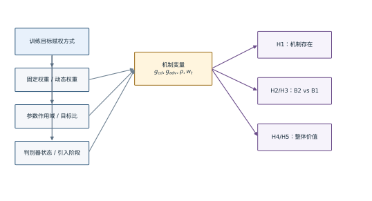
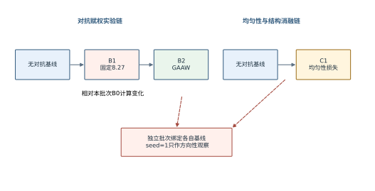

# 第4章 模型假设和研究设计

第3章把“点云质量”拆成多个可测量维度，并规定了每条实验链绑定复现基线、训练seed、真实验证划分和原始证据可追溯等约束。本章进一步把研究动机转写为可证伪命题：若重建与对抗梯度的相对尺度并不变化，自适应赋权的必要性就不能成立；若B2只优于某一个固定权重却仍劣于无对抗基线，则它最多说明缓解了该固定设定造成的退化，不能说明对抗训练本身更优；若显式均匀性损失以更简单的方式取得相同结果，则算法价值还必须接受复杂度和可解释性的竞争。研究设计先于结果裁定，目的在于防止看到数据后重新选择问题、指标或对照组。

## 4.1 重建—对抗梯度关系的作用机制分析

### 4.1.1 研究问题与可证伪假设

本文围绕三个研究问题展开。RQ1询问重建梯度与对抗梯度的相对尺度是否随训练变化；RQ2询问自适应权重能否缓解固定权重8.27造成的性能退化；RQ3询问自适应对抗方案相对无对抗基线和显式均匀性约束究竟具有何种收益与边界。三个问题分别对应机制存在、局部比较和整体价值，不能互相替代。

为使这些问题可被数据否定，提出以下五条假设。

H1：在固定数据、网络和损失定义下，未加权梯度比例 $\rho_t$ 随训练阶段发生实质变化，因而单个固定权重不能在全过程维持同一相对梯度贡献。

H2：在对抗赋权实验批次和固定权重8.27这一具体对照下，B2的局部间距离散代理指标 $\mathrm{cv}_{\mathrm{nn}}$ 低于B1。

H3：在与H2相同的控制条件下，B2相对B1改善 $\mathrm{cv}_{\mathrm{nn}}$ 时，不以明显恶化CD和HD为代价。

H4：B2相对同批次无对抗基线B0不劣，即自适应对抗方案至少不破坏基线的局部间距离散和几何保真。

H5：显式均匀性约束C1是不可省略的竞争基线；若其相对本实验链基线C0改善 $\mathrm{cv}_{\mathrm{nn}}$，则必须同时检查CD、HD与稀疏分层，不能因方法较简单而从主分析中删除。

H1是机制必要性假设；若H1不成立，自适应公式虽仍可计算，但“跟随动态失衡”的解释失去依据。H2和H3检验B2相对特定固定权重的净效应。H4是更强、也更接近实际价值的假设，因为用户最终关心的不是B2能否击败一个不理想权重，而是它是否值得替代无对抗训练。H5不预设C1优于B2，它只要求把直接均匀性路径作为真实竞争者。

五条假设之间不是并列投票关系，而是具有前提依赖。H1若成立，只说明动态观测量不是常数，并不保证利用该观测量就能改善结果；H2若成立，只说明B2在B1这一对照上更好，也不保证B1本身值得采用；H3用于防止H2通过牺牲几何指标换取局部分布改善；H4把比较提升到无对抗基线，决定整个对抗方案是否具有替代价值；H5则从另一方法路径检查“动态对抗”是不是解决分布问题的必要手段。论文的主张强度应沿这条依赖链逐级增加，不能跳过中间条件。

H1的反证条件不仅是“轨迹完全不变”。如果观察到的波动与数值噪声、batch组成或测量作用域变化同量级，仍不足以证明存在需要调节的训练阶段失配。为此，轨迹必须固定参数集合、测量时点、batch记录方式和稳定项，并与重复seed中的变化相比较。若不同seed的比例轨迹方向相反，平均后的大跨度也不能自动解释为稳定机制。

H2和H3的反证条件也需要区分。若B2的 $\mathrm{cv}_{\mathrm{nn}}$均值没有低于B1，H2方向不符合；若均值下降但不同seed方向不一致，则证据不足；若 $\mathrm{cv}_{\mathrm{nn}}$下降而CD或HD出现超过预先设定容忍度的劣化，则H2可以方向符合而H3不成立。这样处理能保留真实权衡，而不是强迫所有结果归入“成功”或“失败”两个箱子。

H4是防止弱对照陷阱的关键。一个自适应方法很容易优于选择不当的固定常数，但实际使用者完全可以关闭对抗分支。因此，无对抗基线不是附加对照，而是决定方案净价值的必要参照。若B2优于B1却劣于B0，论文应把贡献写成“对固定退化的缓解”和“边界测量”，不能写成“提高上采样性能”。

H5引入方法复杂度上的反问：如果一个直接损失以更低训练复杂度达到同样的局部分布变化，为什么需要判别器和额外梯度计算？反之，如果C1只改善最近邻尺度却破坏稀疏区域覆盖，而B2在最坏误差上更好，两者就不是简单替代关系。C1的作用是迫使论文在效果、成本和质量维度之间进行完整比较。

表 4.1 研究假设、比较对象、主要指标与失败解释

| 假设 | 比较或证据 | 主要判据 | 假设失败时允许的解释 |
|---|---|---|---|
| H1 | 原始逐步梯度轨迹 | $\rho_t$存在超过测量噪声的阶段变化 | 当前机制动机未被证据支持 |
| H2 | B2相对B1，同一实验批次 | $\mathrm{cv}_{\mathrm{nn}}$下降 | 自适应赋权未缓解固定设定 |
| H3 | B2相对B1，同一实验批次 | CD、HD不出现实质劣化 | 存在局部分布—几何权衡 |
| H4 | B2相对无对抗基线B0 | 核心指标不劣 | 只能称缓解B1，不能称优于基线 |
| H5 | C1相对本链基线C0 | 同报局部分布与几何指标 | 直接均匀性路径收益不足或有代价 |

表4.1中的“支持”必须满足相应证据层级。当前单seed与11条真实验证交集只能给出探索性方向；最终统计支持要求每组至少3个独立训练seed，并在完整验证或测试协议上以seed为推断单位。旧补测的200条记录以训练划分为主，不能替代验证评价或独立训练重复。

### 4.1.2 变量测量

自变量是训练目标的赋权方式，包含无对抗、固定对抗、自适应对抗和显式均匀性四类。因变量分为质量变量、机制变量和成本变量。质量变量包括CD、HD、$\mathrm{cv}_{\mathrm{nn}}$及Q4/Q1；正式测试阶段还应加入NUC和P2F。机制变量包括 $\|\mathbf g_{\mathrm{cd}}\|_2$、$\|\mathbf g_{\mathrm{adv}}\|_2$、$\rho_t$和实际有效权重。成本变量包括每步时间、峰值显存、训练总时长和推理参数量。

相对变化率统一以对照组为分母。设指标越小越好，对照均值为 $m_c$，实验均值为 $m_e$，则本文表格中的相对变化定义为

$$
\Delta_{e\leftarrow c}=\frac{m_e-m_c}{m_c}\times100\% . \tag{4.1}
$$

式（4.1）中，负值表示实验组改善，正值表示实验组劣化。采用这一符号约定可避免“提升若干百分比”究竟表示数值上升还是质量改善的歧义。正文首次出现每个百分比时，同时给出两个绝对值、比较方向、实验批次和seed；后续才可使用简写。

固定样本的逐样本差值定义为

$$
d_i=M(\mathcal Q_i^{e},\mathcal Y_i)-M(\mathcal Q_i^{c},\mathcal Y_i),\qquad i=1,\ldots,n . \tag{4.2}
$$

式（4.2）中，$M$为某一指标，$n$必须来自同一组未参与训练的评价对象，同一$i$对应相同样本。$\bar d$和样本标准误可用于描述“这一个训练结果在不同对象上的变化”，但不能检验“重新训练后是否仍然出现该变化”。当前可审计的真实验证交集只有$n=11$；后一个问题还需要对每个训练seed先计算完整验证均值，再在seed层面估计方差。

绝对差与相对变化回答的问题也不同。相对变化便于比较量纲不同的指标，却可能在对照值很小时放大很小的绝对差；绝对差保留原量纲，却不便判断其相对基线大小。因此，第6章的核心结果先列绝对均值与跨样本SE，再列相对百分比和配对差值。任何“改善若干百分比”的表述都必须能够由式（4.1）重算，并在首次出现时给出起点与终点，避免百分比脱离测量尺度。

质量变量之间不合成为事后总分。设方法在已测的四项越小越好指标上形成向量 $\mathbf m=[m_{\mathrm{cv}},m_{\mathrm{CD}},m_{\mathrm{HD}},m_{\mathrm{Q}}]$。若实验组每一项均不高于对照组且至少一项更低，才可称其在当前均值向量上形成弱支配；若指标有升有降，则记录为权衡。这里的“均值支配”只是描述观察值，不包含显著性或跨seed稳定性的含义。该规则防止研究者通过临时改变权重，把任一混合结果重新包装成综合提升。

成本变量同样进入研究判断，但不与质量变量混在同一个数值中。B2若在某一质量维度上改善，却需要额外两次梯度测量，其结论应同时包含效果和训练代价；推理阶段无额外开销也不能抵消训练成本尚未测量的事实。只有当质量收益、训练成本与应用偏好都明确时，才适合做是否采用方法的工程决策。

表 4.2 变量、操作性定义和数据来源

| 类型 | 变量 | 操作性定义 | 当前数据来源 |
|---|---|---|---|
| 自变量 | 对抗赋权 | 0、固定8.27或按梯度范数比动态计算 | YAML配置与损失代码 |
| 自变量 | 均匀性约束 | $w_{\mathrm{unif}}=0$或0.00191 | YAML配置 |
| 因变量 | CD、HD | 共享真值坐标框的双向最近邻平方距离诊断 | `_cv_nn_measure.json`与拆分审计 |
| 因变量 | $\mathrm{cv}_{\mathrm{nn}}$ | 输出内部最近邻距离变异系数 | `_cv_nn_measure.json` |
| 因变量 | Q4/Q1 | 最稀疏与最密分层后向误差比 | `_cv_nn_measure.json` |
| 机制变量 | $\rho_t$ | 未加权对抗梯度范数与重建梯度范数比 | 原始轨迹缺失，待恢复或重跑 |
| 成本变量 | 时间和显存 | 相同运行环境、批量与步数下实测 | 原始run summary缺失 |

## 4.2 梯度自适应权重影响因素分析

### 4.2.1 影响因素的识别

自适应权重并不是只由一个公式决定。至少有六类因素会改变结果。

**1. 梯度参数作用域。** VQGAN官方实现对最后一层参数计算重建与对抗梯度范数{{cite:TamingTransformers}}，本文代码默认对生成器全部可训练参数求范数。不同层的梯度尺度和语义不同，因此“最后一层”和“全生成器”不是无关紧要的实现细节，而是需要直接对照的设计选择。

**2. 目标比值。** 当前 $r_{\mathrm{target}}=0.1$ 表示期望加权对抗梯度达到重建梯度的10%。该数值未完成敏感性实验，不能表述为最优目标。合理的补充范围至少应覆盖0.05、0.1和0.2，并在相同seed下比较。

**3. 稳定项和裁剪。** 当 $\|\mathbf g_{\mathrm{adv}}\|_2$ 极小时，权重可能迅速放大；当重建梯度极小时，权重又可能接近零。稳定项 $\varepsilon$只能防止除零，不能限制异常幅度。是否需要上下界、指数移动平均或更新频率控制，应由轨迹而不是直觉决定。

**4. 预热与线性引入。** `adv_warmup_factor`函数支持“先关闭、再线性增加”的策略，但当前B1和B2配置均设 `adv_warmup_epochs=0`、`adv_ramp_epochs=10`。按照代码，epoch 0至9的因子依次为0.1至1.0，而不是旧稿所写的30 epoch预热。研究设计必须以实际配置为准。

**5. 判别器状态。** 判别器学习率、更新频率和容量会改变 $\mathcal L_{\mathrm{adv}}$ 及其梯度。本文固定hinge损失与每步一次判别器更新，只比较生成器侧赋权方式。若改变判别器，必须另立实验，不得并入B1—B2净效应。

**6. 固定权重取值。** 当前B1只有8.27一个点，无法确定B1退化来自“固定权重原则”还是“8.27恰好不合适”。因此，H2即使方向成立，也只能解释为B2优于固定8.27，不能推广到所有固定权重。

六类因素之间还存在层级关系。参数作用域、稳定项和裁剪决定“观测量如何形成”，目标比值决定“观测量映射到多大权重”，线性引入决定“该权重在训练早期实际进入多少”，判别器状态决定“对抗梯度由怎样的教师产生”，固定权重取值则决定B1这一参照点处于何处。若一次实验同时更改多个层级，即使结果改善，也无法判断收益来自更好的测量、映射还是训练日程。因而敏感性实验应分阶段进行：先固定判别器与线性引入，比较参数作用域和赋权公式；再固定最佳作用域，检查目标比值与裁剪；最后才研究判别器更新频率等更宽的系统因素。

影响因素识别还规定了日志字段。参数作用域需要记录被测参数名称或层级摘要；目标比值、稳定项和裁剪需要保存每步配置与有效权重；线性引入需要同时保存原始 $w_t$和乘以$a(e)$后的权重；判别器状态至少需要损失、更新次数和异常回退；固定对照则需要明确常数来源。缺少这些字段时，只能比较最终结果，不能解释权重为什么产生该结果。

### 4.2.2 影响因素的检验安排

影响因素按照“核心必需、边界必需、扩展可选”分级。核心必需包括原始梯度轨迹、至少3个训练seed和正式测试指标；缺失任何一项，H1至H4都只能作初步裁定。边界必需包括固定权重敏感性、目标比值敏感性和Taming-style最后一层对照；缺失时可以报告当前运行，但不能声称方法普遍优于既有动态权重。扩展可选包括指数平滑、权重裁剪和低频更新，可在核心证据完成后研究。

图 4.1展示变量、影响因素和研究假设的连接关系。图中实线表示当前设计已经形成对照，虚线表示必须补充但尚未完成的实验。该图放在变量与影响因素定义之后，避免读者在不知符号含义时先面对复杂流程。

图 4.1 研究变量、影响因素与假设的关系

## 4.3 理论模型和检验设计

### 4.3.1 对照组、随机种子与实验批次

实验矩阵按研究问题分为两个批次。对抗赋权批次包含无对抗基线B0、固定权重B1和自适应权重B2，直接回答对抗赋权问题；均匀性与结构消融批次包含复现基线C0、C1和其他消融，回答显式均匀性与工程变体问题。两个批次均使用相同任务和评价脚本，但训练是独立完成的，因此每个方法首先相对本批次基线解释。

表 4.3 核心实验组差异矩阵

| 组别 | 实验批次 | 对抗权重 | 自适应 | 均匀性权重 | 主要用途 |
|---|---|---:|---|---:|---|
| B0 | 对抗赋权 | 0 | 否 | 0 | B1、B2参照 |
| B1 | 对抗赋权 | 8.27 | 否 | 0 | 固定权重对照 |
| B2 | 对抗赋权 | 动态；目标比0.1 | 是 | 0 | 本文适配机制 |
| C0 | 均匀性与结构消融 | 0 | 否 | 0 | C1及其他消融参照 |
| C1 | 均匀性与结构消融 | 0 | 否 | 0.00191 | 显式均匀性竞争基线 |

每组最终应运行至少3个独立seed，且seed集合在实验前固定。网络初始化、数据顺序和随机增广均由seed控制。为了避免只保留最有利运行，所有已启动seed都应进入结果表，失败运行也需记录失败原因。当前可用数据只覆盖每组一个seed，因此第6章表格使用“单次运行观察”措辞。

“相同seed”在对照设计中用于降低随机差异，但不把两次独立训练变成样本级配对。对于同一seed的B1与B2，初始化和数据顺序可保持一致，方法差异仍通过完整训练轨迹累积；逐样本配对只应发生在未参与训练的固定评价对象上。当前11条真实验证交集只能作探索性配对。训练层面的重复单位仍是seed，评价层面的重复单位才是样本；两者不能互相替代。

两个实验批次使用相同任务定义和评价脚本，并不自动获得方法间的可交换性。独立训练时点、软件状态、选点轨迹或未记录条件都可能形成批次效应。因此，B0—B1—B2构成完整的对抗赋权对照链，C0—C1—其他消融构成另一条对照链。跨链绝对值可以作为描述性背景，但核心效应分别计算B1/B2相对B0以及C1等相对C0。若未来希望直接比较B2与C1，应在同一新实验矩阵中共同重跑B0、B2和C1，而不是复用两条旧链的绝对值。

图 4.2在表 4.3之后给出批次内对照链。表先于图出现，是因为读者需要先看到每个组改变了什么，才能理解箭头代表的比较含义。

图 4.2 核心实验组与批次内对照链

### 4.3.2 统计单位、配对比较与不确定性口径

本文区分三类不确定性。$SD_{\mathrm{sample}}$描述同一个训练模型在不同验证对象上的差异；$SD_{\mathrm{epoch}}$描述单次训练后期的时间波动；$SD_{\mathrm{seed}}$描述从不同随机初始化重新训练的差异。只有 $SD_{\mathrm{seed}}$能够直接支撑“算法重新训练后仍然稳定”的推断。

若最终获得 $S$ 个独立seed，设第 $s$ 个seed的验证均值为 $\bar M_s$，则方法均值和seed标准误为

$$
\bar M=\frac{1}{S}\sum_{s=1}^{S}\bar M_s,\qquad
SE_{\mathrm{seed}}=\sqrt{\frac{1}{S(S-1)}\sum_{s=1}^{S}(\bar M_s-\bar M)^2}. \tag{4.3}
$$

式（4.3）明确把训练seed作为推断单位。当前 $S=1$ 时，$SE_{\mathrm{seed}}$无定义；正文不得用 $SE_{\mathrm{sample}}$或平台区波动填补。对于当前数据，可以报告绝对均值、相对变化、逐样本差值分布和方向一致比例，但显著性语言保留到多seed完成后。

多seed完成后，方法效应应先在每个seed内部相对对应基线计算，再汇总seed差值。设第$s$个seed中实验组和对照组的验证均值分别为$\bar M_{e,s}$与$\bar M_{c,s}$，则

$$
\delta_s=\bar M_{e,s}-\bar M_{c,s},\qquad
\bar\delta=\frac{1}{S}\sum_{s=1}^{S}\delta_s . \tag{4.4}
$$

式（4.4）保留了同一seed对照结构，避免先分别汇总两种方法再相减时丢失配对信息。最终报告应同时给出$\bar\delta$、seed层区间和每个seed的方向，不因均值有利而隐藏方向相反的运行。若seed数仅为3，区间估计本身仍较不稳定，因此结论应与效应大小、方向一致性和原始散点共同解释。

跨样本bootstrap承担的是另一项任务：描述固定的B1与B2模型在一组未参与训练的对象上的平均差异是否被少量样本驱动。重采样单位应是样本ID，并在一次重采样中同时抽取两种方法的对应记录；若分别重采样两组样本，就破坏了配对结构。当前真实验证交集仅11条，bootstrap区间对抽样细节高度敏感，只能作为描述性附加信息，不能替代式（4.4）的训练重复分析。

本研究同时观察多个指标和多组消融，存在从大量结果中挑选有利项的风险。当前处理不是在单seed阶段进行复杂的多重检验校正，而是预先指定H2的主要指标为$\mathrm{cv}_{\mathrm{nn}}$，把CD、HD和Q4/Q1作为共同约束，并完整公开反向结果。未来正式多seed检验若同时对多项主要终点作显著性判断，应预先规定主要终点或采用适当校正；在此之前，正文以效应大小和方向描述为主。

### 4.3.3 内部效度、外部效度和构念效度威胁

内部效度的主要威胁包括独立训练批次差异、checkpoint选择、配置漂移和缺失原始运行包。控制方式是绑定批次基线、固定选点规则、自动比较YAML差异，并为每个数字保存JSONPath与输入哈希。若某组的checkpoint无法恢复，重新训练必须使用新的run ID，不能把新旧派生结果拼成同一运行。

外部效度受到单数据集、单倍率、合成patch和固定骨干限制。即使H2在PU1K成立，也不能推出真实LiDAR、不同点数或扩散模型中同样成立。第7章将把跨数据集、任意倍率和真实扫描作为后续验证，而不是把它们写成当前贡献。

构念效度的主要威胁是把 $\mathrm{cv}_{\mathrm{nn}}$等同于完整均匀性。该指标只度量最近邻间距离散，可能无法区分某些更大尺度的空洞模式；Q4/Q1又混合了输入信息量与模型能力。正式评价需要加入官方或严格复现的NUC、P2F及点云可视化，才能形成更完整的质量判断。

结论效度还受到缺失数据处理方式影响。当前缺少原始梯度轨迹时，最安全的裁定是把H1标为待实验，而不是用epoch平均权重反推出逐步范数；缺少统一计时summary时，训练成本保持未测，而不是从不同日志估算；缺少正式NUC和P2F时，不用$\mathrm{cv}_{\mathrm{nn}}$和CD改名替代。这样的缺失处理会让部分结论暂时留空，却能避免一个可计算的代理量被扩张成它没有测量的构念。

模型选点是另一潜在选择偏差。若不同方法分别从150个epoch中选择最有利checkpoint，而选点分数与最终报告指标部分重合，结果会包含训练方法与选点规则的共同作用。本文使用同一预先实现的选点器并保存最佳epoch，减少方法间规则差异；但最终仍应补充固定epoch结果或选点敏感性，判断结论是否依赖某一个checkpoint。当前第6章因此报告每组最佳epoch，不把它视为无关元数据。

表 4.4 效度威胁与控制措施

| 效度类型 | 主要威胁 | 当前控制 | 尚需补充 |
|---|---|---|---|
| 内部效度 | 训练批次和配置混杂 | 批次基线、差异矩阵 | 原始run包与多seed |
| 内部效度 | 事后选点 | 固定复合选点规则 | 保存每个seed全部轨迹 |
| 构念效度 | 单一均匀性代理 | CD、HD、cv和分层同报 | 正式NUC、P2F与可视化 |
| 外部效度 | 单数据集、单倍率 | 明确范围限定 | 跨数据集和任意倍率 |
| 结论效度 | 样本SE冒充seedSE | 口径分离 | 至少3个独立seed |

## 4.4 研究假设的预注册汇总

本研究使用“方向符合、方向不符合、证据不足、待实验”四种初稿裁定。方向符合仅表示当前单次运行的观察值与假设方向一致；方向不符合表示当前观察值与假设相反；证据不足表示指标可算但缺少多seed或正式协议；待实验表示关键数据本身缺失。最终论文在完成实验后再使用“支持”或“未获支持”。

四种状态还规定了结果更新方式。补充实验只能改变证据状态，不能删除原有不利运行；新的多seed结果应与当前单seed记录共同归档，并说明哪些结论因证据增强、反向或不一致而更新。若最终方向与当前观察相反，论文应回到效度威胁和训练轨迹解释差异，而不是静默替换表格。预注册汇总因此既是写作框架，也是防止选择性报告的版本控制接口。

表 4.5 假设的预注册接收条件与当前可用证据

| 假设 | 初稿方向判据 | 最终接收条件 | 当前证据状态 |
|---|---|---|---|
| H1 | 轨迹显示阶段变化 | 原始轨迹可追溯且多seed复现 | 原始轨迹缺失，待实验 |
| H2 | B2的cv低于B1 | 至少3 seed方向稳定并报告区间 | 单seed可计算 |
| H3 | B2的CD、HD不劣于B1 | 多seed下无实质劣化 | 单seed可计算 |
| H4 | B2不劣于本批次基线B0 | 多seed下核心指标不劣 | 单seed可计算 |
| H5 | C1改善cv并同报代价 | 多seed与正式均匀性指标 | 单seed可计算 |

## 4.5 本章小结

本章把三个研究问题转化为五条可证伪假设，并为每条假设指定了对照、指标、方向和失败后的解释。研究设计明确区分对抗赋权与均匀性消融两条实验链，区分样本、epoch和seed三种统计单位，规定当前单seed只作方向性裁定。影响因素分析进一步指出，参数作用域、目标比值、稳定项、线性引入、判别器状态和固定权重取值都会影响自适应机制，因此B2优于B1并不自动等于B2优于所有固定权重或无对抗基线。

下一章在这些约束下给出GAAW的完整数学形式、代码路径和算法流程，并把VQGAN的直接先例置于方法来源的中心位置。公式的贡献边界将被明确限定为点云场景适配和受控验证，而不是梯度范数比结构的首创。
