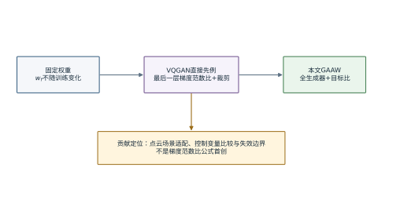
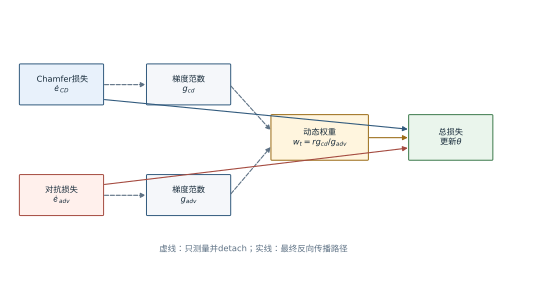

# 第5章 梯度自适应对抗权重机制

第4章提出的H1至H5把方法价值分成三层：首先要确认梯度相对尺度是值得测量的机制变量，其次要判断动态赋权能否改善固定权重8.27这一具体设定，最后还要检查它是否优于无对抗基线和显式均匀性路径。本章给出梯度自适应对抗权重机制（gradient-adaptive adversarial weighting，GAAW）的完整形式。需要在章首先说明原创性边界：按重建梯度范数与对抗梯度范数之比计算动态判别权重，在Taming Transformers/VQGAN的论文和官方实现中已有直接先例{{cite:TamingTransformers}}。本文的工作是把该思想适配到PU-Transformer与点云判别器联合训练，改变梯度参数作用域，引入目标比值，并在点云上采样的批次内对照中测量收益和失效边界，而不是声称首创梯度范数比公式。

## 5.1 方法灵感与问题形式化

### 5.1.1 固定对抗权重的训练期含义

生成器同时接受重建和对抗两条梯度通路。采用hinge形式时，判别器损失和生成器对抗损失分别写为

$$
\mathcal L_D
=\mathbb E_{\mathcal Y}\left[\max(0,1-D_{\phi}(\mathcal Y))\right]
+\mathbb E_{\mathcal P}\left[\max(0,1+D_{\phi}(G_{\theta}(\mathcal P)))\right], \tag{5.1}
$$

$$
\mathcal L_{\mathrm{adv}}
=-\mathbb E_{\mathcal P}\left[D_{\phi}(G_{\theta}(\mathcal P))\right]. \tag{5.2}
$$

式（5.1）中，$D_{\phi}$对真值点云给出较高分数、对生成点云给出较低分数；式（5.2）促使生成器提高生成点云的判别分数。两式与重建损失的数值量纲不同，损失值大小不能直接表示参数更新贡献。真正进入生成器优化器的是各项对参数的梯度。

若对抗权重固定为 $w_f$，生成器损失为

$$
\mathcal L_G^{\mathrm{fixed}}
=\mathcal L_{\mathrm{CD}}+w_f\mathcal L_{\mathrm{adv}} . \tag{5.3}
$$

式（5.3）中，$w_f$在配置层面不变，但其优化含义未必不变。设未加权梯度范数为 $g_{\mathrm{cd}}$和 $g_{\mathrm{adv}}$，则加权后对抗梯度与重建梯度的范数比近似为 $w_f g_{\mathrm{adv}}/g_{\mathrm{cd}}$。若两项随训练以不同速率变化，同一个 $w_f$会在不同阶段对应不同相对作用。这里的“可能变化”是方法动机，不是已经被当前实验确认的事实；H1仍需要原始轨迹恢复或重跑。

当前固定对照B1取 $w_f=8.27$。第3章已经说明，该值的早期标定来源与B-001配置冲突，因此本文不称其为PU-GAN经验值、最优值或经过梯度实测验证的值。它只是已执行实验中的一个固定取值。GAAW相对B1的结论必须完整写成“相对固定权重8.27”，不能缩写为“相对固定权重方法”。

### 5.1.2 从多任务梯度平衡和VQGAN获得的启发

GradNorm通过调整任务权重使梯度范数与训练速率目标相协调{{cite:GradNorm}}，不确定性加权从任务噪声估计权重{{cite:UncertaintyWeighting}}，DWA利用损失下降速率动态赋权{{cite:DWA}}。PCGrad、CAGrad和MGDA等方法进一步关注梯度方向冲突与多目标下降{{cite:PCGrad}}{{cite:CAGrad}}{{cite:MGDA}}。这些工作共同说明，多损失训练中的“权重”应理解为优化过程的一部分，而不是只在训练前确定的静态超参数。

与本文最直接的算法先例是VQGAN。经核对其官方仓库commit `3ba01b241669f5ade541ce990f7650a3b8f65318`，`taming/modules/losses/vqperceptual.py`第63至74行的 `calculate_adaptive_weight` 对重建负对数似然损失和生成器对抗损失在最后一层参数上的梯度求范数，并计算

$$
w_{\mathrm{VQ}}
=\operatorname{clip}\left(
\frac{\|\nabla_{\theta_L}\mathcal L_{\mathrm{nll}}\|_2}
{\|\nabla_{\theta_L}\mathcal L_{\mathrm{adv}}\|_2+10^{-4}},
0,10^4\right)\,w_D . \tag{5.4}
$$

式（5.4）中，$\theta_L$表示最后一层参数，$w_D$为判别损失的全局系数。官方代码在比值后执行裁剪和 `detach`。该永久版本链接为 `https://github.com/CompVis/taming-transformers/blob/3ba01b241669f5ade541ce990f7650a3b8f65318/taming/modules/losses/vqperceptual.py#L63-L74`。这一先例意味着本文不能把“重建梯度范数除以对抗梯度范数”列为原创公式。

本文保留式（5.4）的基本思想，但做出三项场景化选择。第一，把重建项替换为点云双向Chamfer损失，把图像判别器替换为点云判别器。第二，默认在全部生成器可训练参数上计算梯度，而非只取最后一层。第三，引入目标比值 $r_{\mathrm{target}}$，使动态权重表达“希望对抗梯度约为重建梯度的某一比例”。这些选择是否更合适不能由形式差异推出，必须由第6章及后续Taming-style直接对照验证。

图 5.1在说明来源之后给出固定权重、VQGAN先例与本文适配的关系，避免把继承关系隐藏在算法细节之后。

图 5.1 固定权重、VQGAN先例与GAAW的关系

## 5.2 GAAW的模型构建

### 5.2.1 重建梯度和对抗梯度的测量

设用于测量的共同参数集合为 $\Theta\subseteq\theta$。当前代码在调用方未显式传入参数集合时，取生成器全部 `requires_grad` 参数。两条梯度定义为

$$
\mathbf g_{\mathrm{cd}}
=\nabla_{\Theta}\mathcal L_{\mathrm{CD}},\qquad
\mathbf g_{\mathrm{adv}}
=\nabla_{\Theta}\mathcal L_{\mathrm{adv}}, \tag{5.5}
$$

$$
g_{\mathrm{cd}}
=\left(\sum_{\vartheta\in\Theta}\|\nabla_{\vartheta}\mathcal L_{\mathrm{CD}}\|_2^2+\varepsilon\right)^{1/2},\qquad
g_{\mathrm{adv}}
=\left(\sum_{\vartheta\in\Theta}\|\nabla_{\vartheta}\mathcal L_{\mathrm{adv}}\|_2^2+\varepsilon\right)^{1/2}. \tag{5.6}
$$

式（5.5）规定两条损失必须在同一参数集合上比较，否则范数差异可能仅来自参数数量不同。式（5.6）把每个参数张量的平方梯度求和后开方，$\varepsilon=10^{-8}$用于数值稳定。代码通过两次 `torch.autograd.grad(..., retain_graph=True, allow_unused=True)`计算这两个量；未参与某条路径的参数返回空梯度并被排除。

选择全部生成器参数的优点是覆盖对抗信号从坐标回归层向特征编码层传播的完整路径，缺点是权重可能被大量浅层梯度主导，并增加计算开销。VQGAN最后一层作用域更局部，权重只反映输出层附近的竞争关系。两者没有理论上的无条件优劣，因此“全参数作用域”是本文需要审计的实现选择，不是天然贡献。

全参数范数还隐含了跨层聚合规则。式（5.6）把所有参与参数的平方梯度直接求和，参数量较多或梯度幅度较大的层会对总范数贡献更多；它没有先对每层按参数数目归一化，也没有赋予坐标回归层更高语义权重。因而该范数表达的是当前优化器参数空间中的总体欧氏尺度，而不是每层平均相对变化。若两个损失分别集中作用于不同层，总范数相等也不代表它们在各层产生相同影响。

这一性质决定了参数作用域对动态权重具有构成性影响，而不是单纯的计算加速选项。设$\Theta=\Theta_{\mathrm{enc}}\cup\Theta_{\mathrm{head}}$，重建梯度主要集中于坐标头、对抗梯度同时扩散到编码器时，全参数比值会把编码器上的对抗梯度计入分母；只测最后一层则不会。两种权重可能因此朝不同方向变化。直接对照时除最终指标外，还应报告分层范数，使“全参数是否更合适”成为可观察问题。

`allow_unused=True`处理的是某些参数未参与某条损失图的合法情况，但也可能掩盖意外断图。如果一个本应接收对抗信号的主要模块长期返回空梯度，简单排除后仍能产生有限权重，训练却已经偏离设计。实现审计因此不能只检查函数是否返回数值，还要记录参与两条范数计算的参数张量数量、空梯度比例和异常层名。当前结果包未保存这些逐步字段，所以本文只确认代码路径，不声称所有batch的梯度覆盖均已验证。

表 5.1 GAAW主要符号与代码对应关系

| 符号 | 含义 | 当前取值或代码位置 |
|---|---|---|
| $\Theta$ | 梯度范数测量参数集合 | 默认全部生成器可训练参数 |
| $g_{\mathrm{cd}}$ | 重建梯度L2范数 | `adaptive_adv_weight` |
| $g_{\mathrm{adv}}$ | 对抗梯度L2范数 | `adaptive_adv_weight` |
| $r_{\mathrm{target}}$ | 目标梯度比例 | 0.1 |
| $\varepsilon$ | 数值稳定项 | $10^{-8}$ |
| $w_t$ | 第$t$步自适应权重 | 每个训练batch重新计算 |
| $a(e)$ | 第$e$个epoch的引入因子 | 0.1到1.0线性增加 |

### 5.2.2 自适应对抗权重的计算

GAAW希望加权对抗梯度的范数达到重建梯度的 $r_{\mathrm{target}}$ 倍，即

$$
\|w_t\mathbf g_{\mathrm{adv}}\|_2
\approx r_{\mathrm{target}}\|\mathbf g_{\mathrm{cd}}\|_2 . \tag{5.7}
$$

因为 $w_t$是非负标量，式（5.7）可解得当前实现的动态权重：

$$
w_t
=r_{\mathrm{target}}\frac{g_{\mathrm{cd}}}{g_{\mathrm{adv}}+\varepsilon}. \tag{5.8}
$$

式（5.8）中，当前 $r_{\mathrm{target}}=0.1$。若 $g_{\mathrm{adv}}$相对较小，$w_t$增大；若对抗梯度已经较大，$w_t$减小。返回值经 `.item()`转换为Python标量，以分离权重计算图，因而后续总损失反向传播不会计算 $w_t$对参数的二阶导数。

式（5.8）与式（5.4）的核心比值相同，但存在三个具体差别：参数作用域不同；式（5.8）显式乘以目标比值；当前实现没有像VQGAN那样对动态权重设上限。最后一点意味着极小 $g_{\mathrm{adv}}$可能产生极大权重。虽然 $\varepsilon$防止除零，它不能提供强有界保证。原始轨迹缺失时，本文不能断言训练中从未出现极端值；异常权重监控与裁剪是后续实现审计的重点。

目标比值的含义需要与损失权重区分。$r_{\mathrm{target}}=0.1$约束的是当前参数作用域上的梯度范数比例，不是$\mathcal L_{\mathrm{adv}}$占总损失值的10%，也不是一次优化步中10%的参数变化必然来自对抗项。Adam还会根据一阶、二阶动量对合成梯度逐坐标缩放，因此式（5.7）描述优化器输入前的梯度尺度，而非优化器输出后的精确位移比例。把目标比值称为“对抗贡献10%”时必须附带这一限定。

稳定项的位置也影响极端区间。当前分母采用$g_{\mathrm{adv}}+\varepsilon$，而$g_{\mathrm{adv}}$内部又按式（5.6）加入稳定项；这保证零梯度附近仍能计算，却会使理论上的精确比例只在梯度显著大于$\varepsilon$时近似成立。当对抗梯度极小时，权重可能由稳定项主导；当重建梯度极小时，权重接近零并可能让对抗分支暂时失去作用。因而日志至少应同时保存原始范数和权重，不能仅根据权重大小推断是哪一条梯度发生变化。

### 5.2.3 线性引入、稳定项和异常回退

代码允许先关闭对抗损失若干epoch，再在指定区间内线性引入。设关闭期为 $E_w$，线性区间为 $E_r$，引入因子定义为

$$
a(e)=
\begin{cases}
0, & e<E_w,\\
\dfrac{e-E_w+1}{E_r}, & E_w\le e<E_w+E_r,\\
1, & e\ge E_w+E_r.
\end{cases} \tag{5.9}
$$

当前B1与B2均取 $E_w=0$、$E_r=10$，所以epoch 0的因子为0.1，epoch 9及以后为1.0。它不是“前30个epoch纯重建”，也不是先完成预热后才启用GAAW；B2从第一个epoch起就计算动态权重，只是其有效值乘以 $a(e)$。

线性引入使实际目标比例在前10个epoch同样随时间变化。忽略稳定项时，加权对抗梯度与重建梯度的目标比近似为$a(e)r_{\mathrm{target}}$，即从0.01逐步增至0.1。B1使用相同$a(e)$，因此B1—B2比较控制了引入日程；但B2前期仍需额外计算梯度范数。若未来设置$E_w>0$，关闭期内继续计算而不使用动态权重会增加无效开销，是否跳过测量应在实现与日志中明确。

预热与自适应还可能产生不同的解释作用。线性因子依据epoch单调变化，是研究者事先规定的外生日程；$w_t$依据当前batch梯度变化，是数据和模型状态共同决定的内生量。最终有效权重$a(e)w_t$同时包含两者。只画有效权重曲线无法判断变化来自预设日程还是梯度测量，因此机制图应分别展示$a(e)$、$w_t$及其乘积。

若参数集合为空，代码记录 `adv_adaptive_error` 并退回固定路径；若 `autograd.grad` 因计算图不可用而抛出运行时错误，同样记录错误后使用固定权重。该回退保证训练不因日志或无梯度环境直接中断，但也带来审计要求：任何出现回退的run都不能被默认为“完整执行了GAAW”。最终结果包必须检查错误日志的出现次数；若发生回退，应单独报告，而不能把该run与纯GAAW混合。

## 5.3 GAAW的训练机制

### 5.3.1 判别器更新

每个训练batch首先更新判别器。生成器在无梯度模式下产生假点云，判别器根据式（5.1）计算损失，随后清空判别器梯度、反向传播并执行一步优化。当前 `d_steps=1`，意味着每个生成器batch前更新一次判别器。假点云在判别器路径中执行 `detach`，因此这一步不更新生成器。

判别器更新不乘 $w_t$。这一设计将GAAW的作用限制在生成器侧：它调整“生成器多大程度听从判别器”，不直接调整“判别器多快学习”。若将 $w_t$同时作用于式（5.1），机制将变成生成器和判别器耦合调节，B1与B2的比较对象也随之改变。

### 5.3.2 生成器更新与梯度路径

判别器更新后，生成器重新前向得到预测点云，计算 $\mathcal L_{\mathrm{CD}}$和 $\mathcal L_{\mathrm{adv}}$。若自适应开关关闭，实际权重为 $w_f a(e)$；若开关开启且梯度测量成功，实际权重为 $w_t a(e)$。B2的生成器损失为

$$
\mathcal L_G^{\mathrm{GAAW}}
=\mathcal L_{\mathrm{CD}}+a(e)w_t\mathcal L_{\mathrm{adv}} . \tag{5.10}
$$

式（5.10）中，动态权重本身已从计算图分离。实现先用 `autograd.grad`读取两条梯度范数，再对完整总损失执行常规 `backward()`，最后由Adam更新生成器参数。该流程的目的不是把两条梯度逐坐标改写成同方向，而是只调节对抗分支的整体尺度。因此它不能解决PCGrad或CAGrad所针对的方向冲突；即使两项范数达到目标比例，余弦相似度仍可能为负。

为说明这一边界，设两条梯度的夹角为$\alpha_t$，则合成梯度范数满足

$$
\|\mathbf g_{\mathrm{cd}}+a(e)w_t\mathbf g_{\mathrm{adv}}\|_2^2
=g_{\mathrm{cd}}^2+a(e)^2w_t^2g_{\mathrm{adv}}^2
+2a(e)w_tg_{\mathrm{cd}}g_{\mathrm{adv}}\cos\alpha_t . \tag{5.11}
$$

式（5.11）表明，相同的两项范数和相同权重在$\cos\alpha_t>0$与$\cos\alpha_t<0$时会产生不同的合成更新。GAAW通过式（5.8）决定第二项的尺度，却没有控制交叉项。若对抗与重建梯度强烈反向，减小或增大权重都可能改变重建方向；若近似正交，动态权重更接近在参数空间加入独立分量。未来轨迹应把余弦相似度与范数比同时记录，才能区分尺度失衡与方向冲突。

梯度范数比还具有一种有限的尺度抵消性质。若只把生成器对抗损失乘以正常数$c$，则$g_{\mathrm{adv}}$近似变为$cg_{\mathrm{adv}}$，动态权重近似变为$w_t/c$，于是忽略稳定项时有

$$
\left(\frac{w_t}{c}\right)\nabla_{\Theta}\!\left(c\mathcal L_{\mathrm{adv}}\right)
=w_t\nabla_{\Theta}\mathcal L_{\mathrm{adv}} . \tag{5.12}
$$

式（5.12）说明GAAW对对抗损失的纯常数重标度在生成器侧近似不敏感，这也是测量梯度而非直接比较损失值的理由之一。但该性质不覆盖判别器损失被重标度、裁剪触发、稳定项占主导或Adam状态改变等情况，更不意味着对不同对抗损失形式保持不变。它只能作为公式性质，不能代替经验对照。

`.item()`或`detach`使$w_t$在最终反向传播中被当作常数。若不分离计算图，优化器还会接收权重对参数变化的二阶项，算法就不再是简单的梯度尺度平衡，显存与数值行为也会改变。当前实现的主张因此应精确写成“先测量当前图上的范数，再把所得标量用于本步总损失”，而不是“学习一个可微权重函数”。

图 5.2展示从两条损失到动态权重、总损失和参数更新的梯度路径。图中虚线表示“只测量、不进入二阶导数”的范数路径，实线表示最终反向传播路径。

图 5.2 GAAW的梯度测量和生成器更新路径

### 5.3.3 完整算法和伪代码

表 5.2 GAAW单个训练batch的执行步骤

| 步骤 | 操作 | 更新对象 | 必须记录的审计量 |
|---:|---|---|---|
| 1 | 无梯度生成假点云，计算判别器hinge损失 | 判别器 | $\mathcal L_D$ |
| 2 | 重新前向生成点云 | 无 | 输入batch和预测标识 |
| 3 | 计算CD与生成器对抗损失 | 无 | $\mathcal L_{\mathrm{CD}}$、$\mathcal L_{\mathrm{adv}}$ |
| 4 | 在同一 $\Theta$ 上计算两项梯度范数 | 无 | $g_{\mathrm{cd}}$、$g_{\mathrm{adv}}$ |
| 5 | 按式（5.8）计算 $w_t$，按式（5.9）得到 $a(e)$ | 无 | $w_t$、$a(e)$、回退状态 |
| 6 | 按式（5.10）形成总损失并反向传播 | 生成器 | 有效权重和总损失 |
| 7 | 更新学习率与epoch汇总 | 优化器状态 | epoch均值和原始逐步轨迹 |

算法执行中的关键不是步骤数量，而是记录粒度。只保存epoch内 $w_t$的算术平均，无法还原 $g_{\mathrm{cd}}/g_{\mathrm{adv}}$的均值，因为倒数和平均不可交换。若要检验H1，应逐步保存 $g_{\mathrm{cd}}$、$g_{\mathrm{adv}}$、$w_t$、有效因子和batch索引，或者至少保存可验证的分位数与原始采样点。旧稿根据epoch平均权重反解“平均梯度比例”的做法只适合趋势示意，不足以成为精确机制证据，本稿予以撤回。

完整审计还应包含四类一致性检查。第一，数值一致性：$w_t$能否由同一条记录中的两个范数和目标比重算。第二，日程一致性：有效权重能否由$w_t$和$a(e)$重算。第三，执行一致性：回退标志、空梯度比例和异常值是否与训练日志一致。第四，结果一致性：被评价的checkpoint是否来自同一run与最佳epoch。只有四类检查都通过，梯度轨迹才能作为H1的机制证据；仅有一列平滑后的权重均值不满足这一要求。

记录频率需要在可审计性和存储量之间折中。最完整方案逐batch保存原始值；若训练步数过多，可以预先规定固定间隔采样，并在每个epoch同时保存最小值、四分位数、中位数、最大值、异常计数和回退计数。采样规则必须在看见轨迹前确定，不能只保留看起来变化最大的区间。用于论文作图的数据应由原始记录自动生成，并保存输入哈希，避免图形平滑掩盖短时极值。

## 5.4 方法复杂度与训练代价

### 5.4.1 参数量和推理复杂度

GAAW不改变生成器和判别器结构，也不增加可训练参数。训练完成后只保留生成器进行点云上采样，动态权重函数不参与推理。因此，B2相对无对抗基线和B1的生成器参数量、前向计算图和输出形状相同。若仅比较部署阶段，GAAW的额外推理时间为零。

“不增加参数”不等于“训练零开销”。方法价值需要同时报告训练时间和显存，而不能只用参数量代替成本。由于当前远端run summary未完整归档，本稿不填写每epoch时长和峰值显存，待在统一运行条件、相同batch和固定步数下重新测量。

### 5.4.2 额外梯度计算、时间和显存开销

每个B2生成器步骤除最终总损失反向传播外，还调用两次 `autograd.grad`测量CD与对抗梯度。两次调用复用前向图但需要遍历相应反向路径，并通过 `retain_graph=True`保留计算图直至最终反向传播。因此，B2的训练开销必然高于只做一次总损失反向传播的B1；具体倍数取决于判别器、生成器和运行实现，不能在缺少计时文件时手工估算为论文结果。

额外开销由参数作用域直接影响。全参数测量需要沿生成器全部相关路径收集梯度，最后一层测量只需取得输出层参数的梯度，但仍可能遍历到产生该层输入的部分计算图。理论上不能简单把“两次`autograd.grad`”等同于“两次完整训练反向传播”，也不能据此给出固定三倍开销。可靠测量应把数据加载、判别器更新、生成器前向、两次范数测量和最终反向分别计时，并在预热后重复统计。

显存增加主要来自在范数测量和最终反向之间保留计算图，而不是动态权重这个标量本身。批量大小、点数、邻域构造和判别器特征都会改变峰值，因而成本比较必须与质量实验使用相同配置。若为了容纳B2而减小batch，训练噪声也随之改变，此时成本与性能差异不再能归因于权重机制本身。

表 5.3 固定权重、GAAW和VQGAN式赋权的实现比较

| 项目 | 固定权重B1 | 本文GAAW B2 | VQGAN官方实现 |
|---|---|---|---|
| 动态测量 | 否 | 是 | 是 |
| 梯度参数作用域 | 不适用 | 全部生成器参数 | 最后一层参数 |
| 目标比值 | 无 | 0.1 | 隐含为1，再乘全局系数 |
| 权重裁剪 | 无 | 当前无 | $[0,10^4]$ |
| 线性引入 | 0至9 epoch | 0至9 epoch | `disc_factor`控制 |
| 额外训练反向路径 | 无范数测量 | 两次全参数梯度测量 | 两次最后一层梯度测量 |
| 推理开销 | 无 | 无 | 无 |

表 5.3说明，Taming-style直接对照不能只把方法名称加入表格，而应真实实现最后一层作用域、裁剪规则和全局系数。若只比较GAAW与GradNorm而缺少最相近的VQGAN式对照，原创性和工程选择仍无法被充分评价。

## 5.5 与已有方法的关系和适用边界

### 5.5.1 与固定权重、GradNorm和VQGAN权重的比较

固定权重方法假定一个常数在训练全过程足以表达期望的对抗贡献。GAAW放松这一假定，每个batch重新测量梯度尺度；但在固定权重敏感性未完成前，现有B1只代表8.27一个点。若某个其他固定权重达到与B2相同或更好结果，GAAW的价值可能主要体现在减少调参，而不是提高最优性能。

GradNorm的目标是协调多个任务的训练速率，它不仅查看梯度范数，还使用各任务相对初始损失的下降速度{{cite:GradNorm}}。GAAW不建模训练速率，也不学习任务权重；它直接设置两分支的瞬时范数比例。因此二者不是包含关系，更不能在未实验时写成“GradNorm在两任务下退化为GAAW”。

VQGAN式权重与GAAW共享最核心的梯度范数比结构。本文相对它的可验证问题是：在点云上采样中，对全生成器参数测量是否比最后一层更合适；显式目标比值是否改善可控性；不裁剪是否引入异常风险；同一方法在无对抗、固定对抗和显式均匀性竞争下处于什么位置。只有直接对照完成后，才能把这些实现差异转化为经验贡献。

### 5.5.2 本文方法可以与不可以声称的内容

在当前证据下，可以确认的内容有三项：仓库实现了按式（5.8）逐batch计算的动态权重；实现默认在全部生成器可训练参数上计算两项梯度范数；B1、B2和无对抗基线的核心差异可以由配置和代码定位。第6章还可报告派生JSON中的单次运行结果，但必须保留实验批次、seed、样本和原始产物缺口。

当前不能声称的内容包括：不能声称首次提出梯度范数比动态判别权重；不能声称8.27来自B-001有效标定；不能声称GAAW已在多seed下稳定有效；不能声称它优于无对抗基线、VQGAN式对照或所有固定权重；不能声称不增加训练开销；不能把 $\mathrm{cv}_{\mathrm{nn}}$改善直接写成整体点云质量提升。

表 5.4 方法主张、所需证据和当前状态

| 拟写主张 | 最低证据 | 当前状态 |
|---|---|---|
| 代码实现了动态梯度赋权 | 代码路径与自检 | 可确认 |
| 梯度比例随训练显著变化 | 原始逐步轨迹、多seed | 待恢复或重跑 |
| B2优于固定8.27 | 同批次多seed、正式指标 | 当前仅单seed派生数据 |
| B2优于无对抗基线 | 同批次多seed且核心指标不劣 | 当前结果方向不支持，见第6章 |
| 全参数作用域优于最后一层 | Taming-style直接对照 | 待实验 |
| 训练成本可接受 | 统一条件计时与显存 | 待实验 |

## 5.6 本章小结

本章从固定权重的训练期含义出发，给出了GAAW的梯度测量、权重计算、线性引入、异常回退和交替训练流程。算法以重建和对抗损失对同一生成器参数集合的L2梯度范数为观测量，通过 $w_t=r_{\mathrm{target}}g_{\mathrm{cd}}/(g_{\mathrm{adv}}+\varepsilon)$调节生成器侧的对抗贡献。当前实现取全生成器参数、目标比值0.1，并在前10个epoch将有效权重从0.1线性增加到1.0。

本章同时明确了方法来源和证据边界。VQGAN官方代码已经实现重建梯度范数与对抗梯度范数之比，因此本文贡献只能定位为点云场景适配、参数作用域选择、目标比值设计和边界验证。GAAW不增加推理参数与推理计算，但训练时增加两次梯度范数计算；缺少统一条件计时前不能声称训练零开销。第6章将依据现有JSON报告B1、B2、无对抗基线和C1的真实观察值，并将H1的缺失、H4的反向结果以及多seed不足一并纳入结论。
