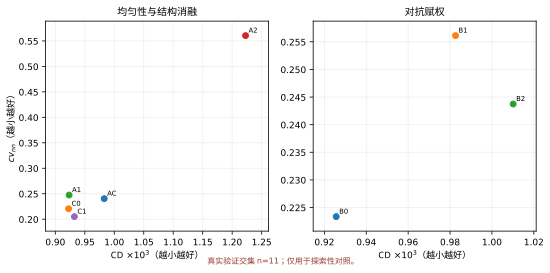
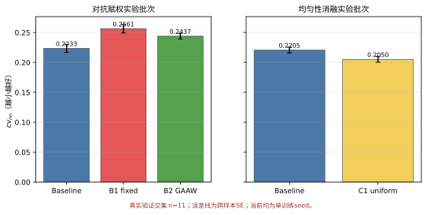
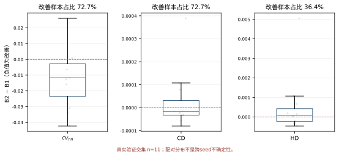
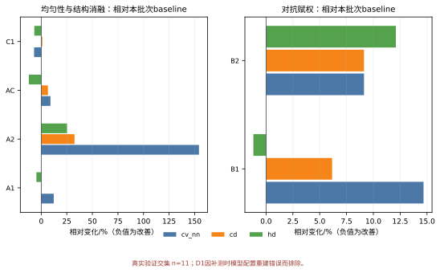

# 第6章 实验结果与边界分析

第4章预先规定了研究假设、比较对象和统计单位，第5章给出了GAAW的实现形式。本章只使用仓库中能够直接读取并经过拆分审计的实验记录回答这些问题。原始逐样本文件为`docs/_cv_nn_measure.json`，抽样归属审计及真实验证交集汇总为`docs/_split_audit_and_holdout_subset.json`；统计与图形由`scripts/build_thesis_figures.py`生成，并汇总到`docs/_thesis_results_summary.json`。这一安排使正文数值、表格和图形共享同一纠正后的数据入口。

本章的结论强度受四项条件限制。第一，当前每组只有一个训练seed，不能声称跨seed稳定或统计显著。第二，旧补测的200条记录中只有11条属于训练时留出的真实验证划分，其余189条属于训练划分；故本文撤回旧稿基于200条记录的验证主张，只报告11条交集的探索性结果。第三，补测脚本按真值中心和尺度共同归一化预测与真值，其CD、HD属于共享真值坐标框诊断，不是正式独立归一化测试指标。第四，部分原始训练日志与checkpoint未入库，D1又因补测时未按配置重建模型而无效；正式NUC、P2F和定性点云也未齐备。

## 6.1 实验设置

### 6.1.1 数据集、训练配置和运行环境

实验使用PU1K的4倍点云上采样设置，输入点数256，输出和真值点数1024。训练脚本以固定置换划出5%验证集；旧补测脚本则从数组尾部5%抽取200条记录。拆分审计重建训练划分后得到11条真实验证交集，所有可比较运行在这11个共同索引上重新汇总。输入patch、拆分错误及指标实现见第3章。

核心模型沿用相同PU-Transformer生成器配置：通道序列32、64、128、256、256，邻域规模20，SC-MSA缩减比4，shuffle上采样，双向平方Chamfer重建损失。优化器、批量、学习率计划和epoch上限在派生配置中保持一致。不同实验的最佳epoch由既定选点器给出；第6章的补测对各自 `best.pt`执行相同推理脚本。

实验按研究问题分为两个独立批次。对抗赋权批次比较无对抗基线B0、固定权重B1和自适应权重B2；均匀性与结构消融批次比较复现基线C0、显式均匀性约束C1和其他消融。运行设备不作为解释变量，正文只围绕方法配置、对应基线和结果变化展开。

批次划分只服务于因果口径，不构成论文主题。B0与C0在方法定义上都是无对抗、无显式均匀性约束的重建基线，但它们来自独立训练链，最佳epoch也不同。故B1和B2必须相对B0解释，C1、A1、A2和AC必须相对C0解释。D1的补测模型没有按`scale_qk=true`重建，不能进入数值比较。两个基线的绝对值接近也不能把跨批次差值归因于某个方法。

所有组均评价各自选点器确定的最佳checkpoint，因此表6.1中的最佳epoch是结果协议的一部分。B0、B1和B2的最佳epoch分别为126、118和120，C0与C1分别为147和93。epoch不同不表示训练预算不同，它表示统一选点规则在各自轨迹上选择了不同位置。当前数据不能回答固定在同一epoch评价时结论是否完全一致，因而后续应补充固定epoch敏感性；本章仅报告已经归档的最佳checkpoint结果。

表 6.1 核心实验配置、最佳epoch和比较角色

| 组别 | 实验批次 | 最佳epoch | 相对基线的主要改动 | 比较角色 |
|---|---|---:|---|---|
| B0 | 对抗赋权 | 126 | 无对抗、无均匀性损失 | B1、B2基线 |
| B1 | 对抗赋权 | 118 | $w_{\mathrm{adv}}=8.27$，固定 | 固定权重对照 |
| B2 | 对抗赋权 | 120 | 目标比0.1，逐batch动态赋权 | GAAW实验组 |
| C0 | 均匀性与结构消融 | 147 | 无对抗、无均匀性损失 | C1及其他消融基线 |
| C1 | 均匀性与结构消融 | 93 | $w_{\mathrm{unif}}=0.00191$ | 显式均匀性竞争基线 |

### 6.1.2 对照方法、消融组和实现来源

B1与B2都启用PU-GAN式点云判别器和hinge对抗损失{{cite:PUGAN}}。B1在生成器侧使用固定8.27；B2在每个batch按第5章式（5.8）计算动态权重。两组均设置 `adv_warmup_epochs=0`和 `adv_ramp_epochs=10`，所以epoch 0至9的引入因子从0.1线性增加到1.0。B2配置里的 `w_adv=8.27`仅在动态计算失败时作为回退路径，正常执行时实际有效权重由GAAW覆盖。

C1开启PU-GAN式显式均匀性损失，权重0.00191。A1把双向CD权重改为前向1.078971、后向0.921029；A2采用对称的反向强化设置；AC同时使用A1和C1；D1原训练配置在SC-MSA注意力分数中开启$1/\sqrt d$缩放。A1、A2、AC和C1相对C0比较；D1只保留为待重新补测的配置，不报告旧数值。

表 6.2 消融组的单一改动与解释问题

| 组别 | 配置改动 | 试图回答的问题 |
|---|---|---|
| A1 | $w_{\mathrm{fwd}}=1.078971$，$w_{\mathrm{bwd}}=0.921029$ | 降低后向占比是否改善分布 |
| A2 | $w_{\mathrm{fwd}}=0.921029$，$w_{\mathrm{bwd}}=1.078971$ | 强化覆盖项的反向对照 |
| C1 | $w_{\mathrm{unif}}=0.00191$ | 直接均匀性约束的收益和代价 |
| AC | A1与C1同时开启 | 两类约束是否互补 |
| D1 | `scale_qk=true` | 补测模型重建错误，待重测 |

### 6.1.3 评价指标、模型选点和统计口径

本章报告四类量。CD为双向平均最近邻平方距离之和；HD为双向最坏最近邻平方距离；$\mathrm{cv}_{\mathrm{nn}}$为输出点云内部最近邻距离的变异系数；Q4/Q1为输入最稀疏四分位与最密四分位的后向覆盖误差比。四项均越小越好，但回答的问题不同。

表格中的“均值±SE”以11条真实验证交集为单位。该SE只描述当前11个对象的离散，记为$SE_{\mathrm{sample}}$；样本太少，既不能代表完整验证集，也不等于重新训练后的$SE_{\mathrm{seed}}$。相对变化按第4章式（4.1）计算，负值表示改善、正值表示劣化。配对分析使用相同样本ID计算B2减B1的差值；bootstrap仅作敏感性描述，不用于显著性结论。

同一张表同时保留均值、SE、相对变化和改善样本比例，是因为四者不能互换。均值回答这11个对象上的方向，SE描述小样本内部波动，相对变化提供相对基线的尺度，改善比例则显示方向是否由少数样本驱动。一个方法可能多数样本改善却被少数大幅退化抵消。逐样本配对能够揭示这种情形，但完整验证集和重新训练seed才是算法可重复性的证据。

本章不以跨样本区间是否包含0作为唯一裁定标准。原因是研究假设的推断单位预先规定为训练seed，而当前只有一个seed；对CD和HD给出bootstrap区间，是为了描述固定模型的对象异质性，不是补做一个看似正式的显著性检验。相应地，$\mathrm{cv}_{\mathrm{nn}}$区间不含0也仍写作“本次运行方向符合”，CD、HD区间含0则写作“均值方向改善但样本异质性较强”。

### 6.1.4 证据文件和复现路径

当前证据链包括YAML配置、训练与评价代码、200条旧补测记录、拆分审计、11条真实验证交集汇总、作图脚本和图形。`_cv_nn_measure.json`保存每个样本的索引、CD前后向分量、HD、最近邻间距和四个稀疏分层值；`_split_audit_and_holdout_subset.json`记录其训练/验证归属及D1无效原因。生成脚本只读取交集记录写出`_thesis_results_summary.json`。

为防止正文、表格与图形各自维护一套数字，本章采用单一数据入口。核心百分比由脚本读取对应基线和实验组均值后计算，配对差值由共同样本ID连接，图6.1至图6.4直接读取同一汇总对象。若源JSON改变，哈希、表格和图形应一起重生成；只修改正文中的小数不构成有效更新。该过程保证的是计算一致性，并不弥补原始checkpoint缺失，因此表6.3同时列出“在库”和“缺失”两类证据。

派生数据的接收依赖四个核验：训练划分由训练代码重建；每组真实验证交集均为同一11个索引；汇总均值可由逐样本记录重算；补测模型构造必须与运行配置一致。D1在第四项失败，因而被停止生成比较图。正式归档还需记录评价脚本版本、源JSON哈希和生成时间。

表 6.3 结果数字的文件级追溯关系

| 内容 | 文件 | 作用 | 当前状态 |
|---|---|---|---|
| 实验配置 | `configs/*.yaml` | 定义组间改动 | 在库 |
| 算法实现 | `puvnet/losses/upsampling.py`、`puvnet/models/pu_gan.py` | 定义损失与GAAW | 在库 |
| 逐样本补测 | `docs/_cv_nn_measure.json` | 旧派生记录 | 在库，200条中189条属训练划分 |
| 拆分审计 | `docs/_split_audit_and_holdout_subset.json` | 真实验证交集与无效运行标记 | 在库，交集n=11 |
| 自动汇总 | `docs/_thesis_results_summary.json` | 交集百分比与配对统计 | 在库 |
| 作图脚本 | `scripts/build_thesis_figures.py` | 生成图6.1至图6.4 | 在库 |
| 原始训练包 | `runs/*`日志与checkpoint | 从头重放训练 | 当前仓库不完整 |
| 正式测试NUC/P2F | 待执行 | 完整评价 | 缺失 |

## 6.2 数据预分析与基线诊断

### 6.2.1 指标方向性和极端对照校准

在解释模型差异前，先检查指标方向。CD和HD直接按第3章公式计算，较小表示平均或最坏几何误差下降。$\mathrm{cv}_{\mathrm{nn}}$较小表示最近邻间距的相对离散程度下降，但不保证点位于正确曲面。Q4/Q1较小表示最稀疏区域相对最密区域的覆盖差距缩小，但若所有区域同时恶化，该比值仍可能下降。因此，本章不把任一单项作为“综合质量分数”。

Q4/Q1还存在分母效应。该比值下降既可能来自Q4误差下降，也可能来自Q1误差上升；在缺少四个分层绝对值时，单看比值无法区分两者。本章的源JSON保存Q1至Q4分层值，主表为控制篇幅只列比值，因此任何“稀疏区改善”判断都必须与CD、HD和分层绝对值共同核对。正式附录还应补充分层曲线，使读者能够判断变化发生在最稀疏区、最密区还是二者同时发生。

D1不能作为指标方向性的示例。审计发现，补测时使用了模型默认的`scale_qk=false`，而D1训练配置要求`scale_qk=true`；该开关不改变权重结构，错误加载不会触发维度异常，却会使前向模型与训练配置不一致。因此，旧D1数值属于无效测量，本章只记录配置重建失败，不展示、不比较，也不据此评价注意力缩放本身。图6.4和表6.5—表6.6均排除D1。

### 6.2.2 无对抗基线的局部间距离散现象

C0在11条真实验证交集上的 $\mathrm{cv}_{\mathrm{nn}}$均值为0.220480，真值点云为0.053539，二者比值为4.12；11条记录的预测值均高于对应真值。与此同时，共享真值坐标框诊断CD均值为0.00092255，HD均值为0.00439569。该现象说明，在当前固定模型和这11条探索性记录中，输出内部的最近邻间距比真值更离散。该结论不外推到完整验证集。

这一观察不能被写成PU-Transformer普遍缺陷，因为当前系统是特定复现实现、特定选点和特定数据处理的组合；它也不能说明局部离散必然由Chamfer损失单独造成，因为网络结构、训练时长和优化器同样可能参与。它能够支持的较窄结论是：在本文基线中，$\mathrm{cv}_{\mathrm{nn}}$提供了CD之外的非冗余诊断信息，因而对抗分支和显式均匀性分支必须在该指标上接受检验。

### 6.2.3 稀疏分层、双向Chamfer和指标相关性

C0的Q4/Q1为1.4707，B0为1.4859。两值分别作为对应实验批次的基线，不能因接近而合并。比值大于1表示输入最稀疏区域的后向覆盖误差高于最密区域，但其中既包含模型能力差异，也包含稀疏区域本身信息不足所造成的任务难度。

B0与C0的四项绝对值也处于相近范围：$\mathrm{cv}_{\mathrm{nn}}$分别为0.223349和0.220480，CD分别为0.00092564和0.00092255，HD分别为0.00409083和0.00439569。该接近程度没有被用作跨批次可交换性的证明，因为单次训练结果相近仍可能是偶然；但它说明评价脚本没有把两个基线计算到明显不同的数量级。论文因此采用“数值背景一致、效应仍按批次计算”的双重口径。

双向Chamfer分量可帮助解释覆盖与贴合，但当前正文主表只报告二者之和。若总CD变化很小，前向与后向分量仍可能反向抵消；Q4/Q1又只针对按输入稀疏度分层的后向误差。后续完整结果应把前向、后向及四个分层放在附表中，主文只保留与假设直接相关的汇总。当前没有从未展示的分量中选择性提取有利结果。

局部分布、平均几何误差和最坏误差可能反向变化。图 6.1把各运行放在CD—$\mathrm{cv}_{\mathrm{nn}}$平面中，并按实验批次分面。理想改进应向左下移动；只向左或只向下都代表权衡，而不是无条件优越。

图 6.1 几何保真与局部间距离散的权衡

## 6.3 核心假设检验

表6.4在所有解释之前列出核心绝对结果。该顺序使读者先看到原始均值和跨样本SE，再阅读相对百分比，避免只用百分比放大微小绝对差异。

表 6.4 核心实验结果（均值±跨样本SE，真实验证交集$n=11$，单训练seed）

| 实验批次 | 运行 | $\mathrm{cv}_{\mathrm{nn}}$ | CD | HD | Q4/Q1 |
|---|---|---:|---:|---:|---:|
| 对抗赋权 | B0 | 0.223349±0.006717 | 0.00092564±0.00005548 | 0.00409083±0.00035630 | 1.4859 |
| 对抗赋权 | B1 fixed | 0.256126±0.007060 | 0.00098261±0.00007146 | 0.00404261±0.00052548 | 1.5802 |
| 对抗赋权 | B2 GAAW | 0.243739±0.004709 | 0.00101014±0.00009854 | 0.00458565±0.00081617 | 1.5448 |
| 均匀性消融 | C0 | 0.220480±0.004859 | 0.00092255±0.00006085 | 0.00439569±0.00055833 | 1.4707 |
| 均匀性消融 | C1 uniform | 0.205037±0.004775 | 0.00093238±0.00006173 | 0.00409824±0.00066295 | 1.7490 |

表6.4中的小数位依据原始计算精度保留，用于保证百分比可以重算，并不表示测量具有同等位数的外部精度。CD与HD的数值约为$10^{-3}$量级，$\mathrm{cv}_{\mathrm{nn}}$和Q4/Q1为无量纲量，不能直接比较列间大小。相对百分比仅在同一指标、同一批次内部计算。

从观察均值的偏序看，B2相对B1仅在$\mathrm{cv}_{\mathrm{nn}}$和Q4/Q1上更小，CD和HD反而更大，因而表现为局部分布—几何权衡，而不是多指标支配。B2相对B0的四项均值全部更大。C1相对C0在$\mathrm{cv}_{\mathrm{nn}}$和HD上更小，在CD和Q4/Q1上更大，同样存在权衡。这样的偏序比一个事后总分更忠实地保留了研究结果。

图 6.2把表 6.4中的 $\mathrm{cv}_{\mathrm{nn}}$按研究问题分为两个面板。误差线是跨样本SE，不是seed误差；每个实验组应首先与同面板基线比较。

图 6.2 核心实验的局部间距离散代理指标

### 6.3.1 无对抗基线与固定对抗权重B1

在对抗赋权实验批次中，B1的 $\mathrm{cv}_{\mathrm{nn}}$相对B0从0.223349上升到0.256126，劣化14.67%；共享真值坐标框诊断CD从0.00092564上升到0.00098261，劣化6.15%；Q4/Q1从1.4859上升到1.5802，劣化6.34%。HD则从0.00409083下降到0.00404261，改善1.18%。因此，固定权重8.27没有形成一致改善，而是以较小的HD下降伴随平均几何误差和局部间距离散恶化。

这一结果回答的是“固定8.27在当前单次运行中发生了什么”，不能证明所有固定权重都会失败。B1只有一个固定取值，且8.27的原始标定证据缺失；更小或更大的权重可能产生不同结果。当前证据支持把B1视为B2的实际对照，却不支持把B1推广为固定权重方法的代表最优点。

B1的结果还说明不同指标可能对对抗监督响应不同。HD改善1.18%，意味着这11条记录上的最坏最近邻平方距离均值略有下降；与此同时CD、局部间距离散和稀疏分层变差。现有数据不足以判断HD变化来自少数离群点、某些形状类别还是选点差异，因而本章不赋予判别器“专门修复最坏点”的机制解释。可确认的只有结果向量发生了这种方向分化。

若只把HD作为选点或应用目标，B1可能得到不同评价；但本文在看见结果前已把$\mathrm{cv}_{\mathrm{nn}}$设为H2主要指标，并要求CD、HD共同报告，不能在B1结果不利后改用HD单项定义成功。应用确实可以赋予HD更高权重，但该偏好需要来自具体任务，而不是来自论文事后选择。

### 6.3.2 固定权重B1与自适应权重B2

B2相对B1使$\mathrm{cv}_{\mathrm{nn}}$从0.256126降到0.243739，相对改善4.84%；Q4/Q1从1.5802降到1.5448，改善2.24%。但CD从0.00098261升至0.00101014，劣化2.80%；HD从0.00404261升至0.00458565，劣化13.43%。因此，在固定权重8.27这一具体对照下，H2的探索性方向符合，H3方向不符合。GAAW缓解了局部间距离散，却没有同时保持平均和最坏几何误差。

逐样本配对分析提供了更细的描述。B2减B1的 $\mathrm{cv}_{\mathrm{nn}}$平均差为−0.012387，11条记录中8条改善，改善比例72.7%，跨样本bootstrap 95%区间为[−0.022853，−0.001527]。CD平均差为 $+2.753\times10^{-5}$，虽然8条记录数值下降，但少数较大退化使均值转为恶化，区间为[$-3.116\times10^{-5}$，$1.100\times10^{-4}$]；HD平均差为 $+5.430\times10^{-4}$，仅4条记录改善，改善比例36.4%，区间为[$-9.615\times10^{-5}$，$1.534\times10^{-3}$]。这些区间只描述11条交集记录的对象异质性，不代表seed级置信区间。

72.7%的方向一致比例与负的$\mathrm{cv}_{\mathrm{nn}}$均值差共同说明，在这11条记录中，局部间距离散的改善并非只由单个极端样本拉动；仍有3条没有改善，故不能写成“所有形状均改善”。CD恰好展示了“改善比例”与“均值方向”不能互换：多数记录改善，但少数退化幅度更大，最终均值仍恶化。HD则只有36.4%的记录改善，均值方向也为恶化，不能描述成对象级收益。

三个指标的区间宽度差异可能与其聚合性质有关。$\mathrm{cv}_{\mathrm{nn}}$由1024个输出点的最近邻间距整体形成，HD则由每个样本的最坏匹配决定，更容易受单个离群点和形状难度影响。这里的“可能”只是对观察到的异质性提出待检验解释，不构成机制结论；要确认原因仍需查看逐样本点云和误差位置。

图 6.3展示11条真实验证交集上的三项配对差值。该图可以支持“当前固定模型在8/11记录上的 $\mathrm{cv}_{\mathrm{nn}}$下降”，但不能支持“完整验证集或重新训练后仍会下降”，因为交集很小且训练seed仍然只有一个。

图 6.3 B1与B2在真实验证交集上的配对差值

### 6.3.3 自适应权重B2与无对抗基线

更强的H4没有获得当前观察方向支持。B2相对同批次无对抗基线B0的 $\mathrm{cv}_{\mathrm{nn}}$从0.223349上升到0.243739，劣化9.13%；CD从0.00092564上升到0.00101014，劣化9.13%；HD从0.00409083上升到0.00458565，劣化12.10%；Q4/Q1从1.4859上升到1.5448，劣化3.96%。四项观察均未占优。

因此，B2的正确定位是“缓解了固定8.27在局部间距离散上的部分退化”，而不是“超过无对抗基线”。如果只报告B2相对B1的4.84%改善而省略B2相对B0四项均劣化，会把局部比较误写成整体价值。当前结果不支持把对抗方案作为无对抗基线的替代方案。

B2相对B0的结果还区分了“局部修正”与“完整方案有效”。自适应权重相对B1降低了$\mathrm{cv}_{\mathrm{nn}}$和Q4/Q1，却同时提高CD和HD；相对B0又没有一项占优。因而只能说GAAW缓解了固定8.27造成的特定局部分布退化，不能说它纠正了对抗训练相对基线的整体代价。这一分解使算法贡献落在实际数据允许的位置。

HD也没有越过B0，而是劣化12.10%。因此，当前11条交集记录上不存在可以抵消其他指标反向结果的单项优势。后续只有在完整验证协议、多seed和正式指标下重新测量，才可重新讨论H4。

### 6.3.4 显式均匀性约束C1的竞争结果

在均匀性消融批次中，C1相对C0的 $\mathrm{cv}_{\mathrm{nn}}$从0.220480下降到0.205037，改善7.00%；HD从0.00439569下降到0.00409824，改善6.77%。但CD从0.00092255上升到0.00093238，劣化1.07%；Q4/Q1从1.4707上升到1.7490，劣化18.92%。

C1因此不是“全面优于基线”，而是同时降低最近邻间距离散和HD，代价是CD略升并明显扩大最稀疏区相对最密区的覆盖差距。该结果揭示了最近邻局部尺度、最坏误差与稀疏分层尺度之间的不一致：输出点的最近邻间距可以更稳定，最坏几何误差也可以下降，但稀疏输入区域的相对覆盖仍可能恶化。

C1的CD劣化1.07%，而Q4/Q1劣化18.92%，说明代价主要没有体现在整体几何均值上。一个待检验的可能性是显式均匀性约束在已有点覆盖较充分的区域更容易调整局部间距，而输入稀疏区因几何信息不足仍难补全；但当前没有区域可视化和梯度证据，本文不把这一可能性写成机制结论。能够确认的是不同尺度的指标方向相反。

从设计选择看，C1的价值在于提供较简单的竞争路径。它不需要判别器和动态范数测量，直接在训练目标中表达局部分布偏好；但简单不等于无代价，Q4/Q1的反向结果必须保留。若后续要把C1发展为更强方案，应优先研究多尺度均匀性与稀疏区加权，而不是只继续压低最近邻变异系数。

C1与B2来自两条独立实验链，正文不根据0.205037与0.243739的绝对值直接断言C1优于B2。能够成立的写法是：C1相对C0使 $\mathrm{cv}_{\mathrm{nn}}$下降7.00%，B2相对B0仍高9.13%；两条事实分别回答各自研究问题。

## 6.4 消融实验与影响因素

### 6.4.1 双向Chamfer权重A1与A2

A1相对C0的 $\mathrm{cv}_{\mathrm{nn}}$上升12.23%，CD上升0.09%，HD下降4.70%，Q4/Q1下降1.17%。这说明轻度降低后向覆盖项权重没有改善主要局部分布指标，但在当前11条交集记录上伴随HD和稀疏分层比值下降。由于四项方向不一致，A1只能被描述为权衡，不能据单项下降称为整体改善。

A2强化后向覆盖项后出现更明显退化：$\mathrm{cv}_{\mathrm{nn}}$上升154.20%，CD上升32.54%，HD上升25.26%，Q4/Q1上升24.37%。A2说明当前加权幅度和方向会明显改变优化结果，但单seed和11条交集记录还不能区分这是稳定的机制效应还是特定训练轨迹失稳。至少在当前探索性结果中，直接强化后向项没有形成可接受的多指标表现。

A1与A2构成方向相反但幅度相同的权重扰动，因此原本可以帮助判断双向CD对权重方向是否对称敏感。观察结果并不对称：A1仅小幅变化，A2出现大幅退化。这种不对称表明前向贴合项与后向覆盖项在当前系统中不能被视为可任意交换的两项；但它仍可能受到优化非线性、最佳epoch和单次随机轨迹影响。没有多seed和训练曲线时，本章只把A2记为风险边界，不进一步宣称后向项必然导致不稳定。

表 6.5和表 6.6保留A1和A2的原因正在于此。失败消融不是与主结论无关的噪声，它限定了“通过简单调整Chamfer方向权重即可改善局部分布”这一替代解释。A1没有改善主要指标，A2更明显退化，说明当前证据没有支持这条更简单路径；这不证明所有双向权重搜索都无效，仍需更细网格与多seed验证。

表 6.5 均匀性与结构消融的局部分布和CD结果

| 运行 | $\mathrm{cv}_{\mathrm{nn}}$ | Δcv | CD | ΔCD |
|---|---:|---:|---:|---:|
| baseline | 0.220480 | — | 0.00092255 | — |
| A1 | 0.247435 | +12.23% | 0.00092341 | +0.09% |
| A2 | 0.560462 | +154.20% | 0.00122273 | +32.54% |
| AC | 0.240334 | +9.00% | 0.00098295 | +6.55% |
| C1 | 0.205037 | −7.00% | 0.00093238 | +1.07% |

表 6.6 均匀性与结构消融的HD和稀疏分层结果

| 运行 | HD | ΔHD | Q4/Q1 | ΔQ4/Q1 |
|---|---:|---:|---:|---:|
| baseline | 0.00439569 | — | 1.4707 | — |
| A1 | 0.00418894 | −4.70% | 1.4536 | −1.17% |
| A2 | 0.00550592 | +25.26% | 1.8292 | +24.37% |
| AC | 0.00386282 | −12.12% | 1.7111 | +16.34% |
| C1 | 0.00409824 | −6.77% | 1.7490 | +18.92% |

### 6.4.2 注意力缩放D1与组合策略AC

D1原计划检验SC-MSA中$1/\sqrt d$注意力缩放的影响，但补测脚本直接实例化默认`scale_qk=false`模型，没有按D1配置重建`scale_qk=true`。该开关不改变state dict结构，错误加载不会报错，因此旧D1输出不能代表D1配置。本论文不报告这些数值，也不对注意力缩放作效果判断；D1被归类为“评价配置重建失败，待重新补测”。

AC把A1与C1组合后，$\mathrm{cv}_{\mathrm{nn}}$、CD和Q4/Q1分别劣化9.00%、6.55%和16.34%，HD改善12.12%。C1单独具有的最近邻间距离散改善没有在AC中保留，说明两个约束的组合没有形成多指标一致收益。由于缺少多seed和梯度轨迹，本章不进一步猜测是梯度冲突、权重尺度还是选点差异导致该结果。

从当前均值看，AC只在HD上低于C0，其余三项均高于C0，因此没有表现出稳定互补性。由于AC同时改变两类损失，结果不能用于估计A1与C1之间的数学交互量；严格的交互分析还需要共同矩阵中的C0、A1、C1和AC多seed结果。现有四组虽具备形式上的二因素组合，却只有单次运行，因此本章使用“未观察到多指标互补收益”，不使用“存在显著负交互”。

D1首先说明评价链必须从配置重建模型，不能只依赖权重结构兼容；AC则说明组合损失不是只在输出端加一个可独立解释的小修补。后续消融应同时保存训练配置快照、训练曲线、梯度范数、选点轨迹和严格的模型构造校验，才能区分模型重建错误、早期发散、收敛到不同区域与最终选点差异。

图 6.4汇总全部消融相对各自批次基线的变化。负值表示改善，正值表示劣化；两个面板分别对应对抗赋权和均匀性消融问题。

图 6.4 全部消融相对批次基线的变化方向

### 6.4.3 固定权重和目标比值敏感性

当前固定权重只有8.27，目标比值只有0.1，因此敏感性问题尚未回答。最小补充设计应在相同seed集合中比较固定权重若干对数间隔取值，并比较 $r_{\mathrm{target}}\in\{0.05,0.1,0.2\}$。每个设置需要报告相同四项指标、动态权重轨迹和训练成本。

敏感性实验不宜把所有组合一次展开成大量单seed运行。更有效的顺序是先在固定seed集合上粗筛固定权重，判断8.27是否处于异常区域；再围绕可接受区间运行多seed；随后比较目标比值与参数作用域。粗筛结果只能用于确定后续范围，最终主张仍以预先固定的多seed矩阵为准。这样既控制计算量，也避免从大量单次结果中选择最有利组合。

在敏感性实验完成前，不能得出“动态权重优于固定权重”的一般结论。当前数据只允许说B2优于B1的8.27取值；如果另一个固定权重达到更好的批次内结果，GAAW的价值需要改写为减少人工搜索或改善某些阶段的自适应，而非最佳性能优势。

### 6.4.4 Taming-style和其他动态加权对照

VQGAN的最后一层梯度范数比是最接近GAAW的先例{{cite:TamingTransformers}}。当前实验没有实现“最后一层作用域、VQGAN裁剪和全局系数”的直接对照，因此无法判断全生成器作用域和目标比值是否带来独立收益。GradNorm、PCGrad或CAGrad可以作为扩展对照，但不能代替最相近的Taming-style对照{{cite:GradNorm}}{{cite:PCGrad}}{{cite:CAGrad}}。

## 6.5 机制测量与过程分析

### 6.5.1 动态权重和梯度比例轨迹

H1需要原始逐batch的 $g_{\mathrm{cd}}$、$g_{\mathrm{adv}}$、$w_t$和回退状态。当前仓库不含与B2配置、checkpoint和batch索引完整对应的原始轨迹。旧稿引用的 `rho_trace_B2.json`也未在仓库中找到，因此本稿删除“跨越3.92×10的若干次方”等机制数字，H1保持待实验。

H1待实验不影响B2与B1的最终指标可以被描述，却限制了对这些指标的因果叙事。当前能够说“实现按梯度范数比计算权重，B2观察值优于B1”；不能进一步说“因为训练中梯度跨若干数量级变化，所以GAAW自动修复了失衡”。后一句同时需要轨迹、时间对应和替代解释排除。方法实现证据与机制解释证据在此明确分开。

未来轨迹重跑还应与最终结果逐seed绑定。若某个seed的$\rho_t$变化大但指标不改善，或轨迹较平稳却指标改善，都会削弱简单的“变化越大、收益越大”解释。机制分析至少需要比较阶段统计、异常权重计数、余弦相似度和最终效应，而不是只展示一条视觉上起伏明显的曲线。

只保存epoch平均动态权重也不足以精确恢复平均梯度比例。因为 $w_t$与 $g_{\mathrm{adv}}/g_{\mathrm{cd}}$互为比例倒数，通常有 $1/\operatorname{Mean}(w_t)\ne\operatorname{Mean}(1/w_t)$。未来重跑应直接记录每步范数或经过预先定义的分位数摘要，并保存参数作用域和代码commit。

### 6.5.2 逐样本差值与局部稀疏分层

B2相对B1的 $\mathrm{cv}_{\mathrm{nn}}$在11条真实验证交集中有8条改善，比例为72.7%，均值相对改善4.84%。CD同样有8条数值下降，但少数较大退化使总体均值劣化2.80%；HD只有4条改善，均值劣化13.43%。这一结果说明，改善样本比例、平均差值和相对百分比必须同时报告：多数对象方向有利并不保证平均指标有利。

B2的Q4/Q1相对B1改善2.24%，相对无对抗基线仍劣化3.96%。这表明“最近邻间距更规则”和“输入最稀疏区的相对覆盖更好”不是同一个构念。B2缓解B1的局部间距离散和稀疏分层比值，却没有恢复到无对抗基线，也以CD和HD均值恶化为代价。

### 6.5.3 几何保真与局部分布的权衡

核心结果形成三种不同权衡。B1相对B0改善HD，却恶化CD、$\mathrm{cv}_{\mathrm{nn}}$和Q4/Q1；B2相对B1改善$\mathrm{cv}_{\mathrm{nn}}$和Q4/Q1，却恶化CD与HD，且相对B0四项都未占优；C1相对C0改善$\mathrm{cv}_{\mathrm{nn}}$与HD，却轻微恶化CD并明显恶化Q4/Q1。

这些结果不支持把任何一组简化为“全面提升”。在当前探索性数据上，无对抗B0对B2四项均占优；C1则提供了直接降低最近邻离散和HD的路径，但其CD与稀疏区代价需要处理。论文的职责是展示这张权衡图，而不是在缺少完整验证和任务偏好时虚构一个统一最优排序。

## 6.6 训练代价与可复现性

### 6.6.1 训练时间、显存和额外反向传播

从代码可以确定，B2每个生成器batch调用两次 `autograd.grad`并保留计算图，随后再对总损失反向传播，因此训练计算量和峰值显存理论上高于B1；推理阶段只保留生成器，额外开销为零。但当前归档缺少B1、B2在统一运行条件下的可靠计时和显存summary，本章不填写具体倍数。

训练成本实验应固定运行环境、软件版本、batch、数据加载线程和步数，先预热再重复测量。若只比较不同远端日志中的总时长，网络传输、验证频率和落盘开销会混入结果。成本未测并不否定方法，但它阻止“低成本”“几乎无开销”等主张进入结论。

### 6.6.2 多随机种子重复与跨运行不确定性

当前每组只有一个训练seed。11条真实验证交集记录、150个epoch或75个后期epoch都不能增加独立训练重复数。最终实验应至少为B0、B1、B2以及C0、C1各运行3个独立seed，并用第4章式（4.3）计算seed均值和标准误。

多seed结果应以散点和配对连线为主，均值与区间为辅。只有3个seed时，单个异常运行会明显影响均值，完整展示每个seed比仅给“均值±标准差”更透明。若某个运行因数值错误失败，需按预先规则判定是否重跑；不能只删除不利但正常完成的运行。所有种子、启动状态和排除理由都应进入实验台账。

若补充seed后H2方向不一致，结论应从“方向符合”降为“结果依赖训练随机性”，并分析轨迹而不是继续扩大样本bootstrap。若H4仍方向不符合，则GAAW的定位保持为固定设定修正器；若H4反转，则还需正式NUC、P2F和成本结果，才能讨论整体替代价值。多seed是必要条件，但不是充分条件。

如果计算资源有限，优先级应是先完成核心五组的3 seed，再扩展A1、A2、AC和D1。原因是研究问题主要依赖H2至H5；在核心结论不稳定时，增加更多单seed消融并不能提高结论可靠性。

### 6.6.3 原始产物、脚本和配置的可获得性

当前仓库已经保留用于本章重算的JSON、脚本和配置，但部分checkpoint、训练历史和环境清单缺失。正式归档应为每个run保存：完整YAML、Git commit、Python和PyTorch版本、seed、训练日志、选点轨迹、最佳checkpoint及SHA-256、验证样本ID、逐样本结果和作图输入。任何重跑都应使用新run ID，避免覆盖当前派生结果。

## 6.7 结果讨论

### 6.7.1 获得方向支持、未获支持与待验证的假设

表 6.7依据第4章预注册规则进行初稿裁定。“方向符合”不等于最终统计支持，“方向不符合”也不等于经过多seed后的永久否定；它们只描述当前单次运行。

表 6.7 研究假设的当前裁定、证据和不可推出内容

| 假设 | 当前裁定 | 主要证据 | 当前不可推出 |
|---|---|---|---|
| H1 梯度比例随训练变化 | 待实验 | 原始轨迹缺失 | 不能声称跨数量级变化 |
| H2 B2的cv低于B1 | 探索性方向符合 | 0.243739 vs 0.256126，改善4.84% | 不能代表完整验证集或跨seed稳定 |
| H3 B2不以CD/HD恶化为代价 | 方向不符合 | CD劣化2.80%，HD劣化13.43% | 不能称几何质量同步改善 |
| H4 B2不劣于无对抗基线 | 方向不符合 | cv、CD、HD、Q4/Q1分别劣化9.13%、9.13%、12.10%、3.96% | 不能称B2优于基线 |
| H5 C1是竞争基线 | 条件符合 | cv和HD改善7.00%、6.77%，CD和Q4/Q1恶化 | 不能称C1全面更优 |

### 6.7.2 失败案例和适用边界

本章最重要的负面结果不是某个数值不够大，而是三个更强主张均未得到当前证据支持。第一，H1没有原始轨迹，机制动因不能用旧稿反解数字代替。第二，B2只在局部间距离散和Q4/Q1上优于B1，CD和HD反而恶化，且四项都没有超过无对抗基线。第三，C1改善最近邻间距离散和HD，但稀疏分层与CD出现代价。A2显示覆盖强化在当前运行中大幅退化；D1则暴露出配置重建错误，因而不能提供算法效果证据。

这些失败结果限制了适用范围。GAAW当前适用于“已经决定采用对抗训练、固定权重8.27出现退化、希望用动态尺度缓解”的窄场景；它尚不能作为替代无对抗训练的默认选择。若实际任务重视HD多于CD和局部间距，B2可能具有不同价值，但需要在具体下游任务中定义权重，不能由本论文代替应用方设定。

### 6.7.3 对研究初衷的回答

论文最初追问的是：当Chamfer距离不能完整表达点分布质量时，是否可以用对抗监督补充，又如何避免固定权重在训练中失配？现有数据给出了一个不迎合预期、但更有信息量的回答。对抗监督并非自动增益；固定8.27在当前运行中明显恶化局部间距离散。GAAW使该指标相对B1改善4.84%，却伴随CD和HD恶化，并且没有恢复到无对抗基线。直接均匀性约束能改善最近邻尺度与HD，却又牺牲CD和稀疏分层。

因此，本文的实际补充不是“找到一个全面更好的万能权重”，而是建立了区分固定对抗、自适应对抗、无对抗和直接均匀性约束的对照框架，并用数据明确指出局部收益与整体失败的分界。该结论比只报告B2相对B1的正向百分比更接近论文初衷：让算法改进接受可证伪测量，而不是让叙事替实验决定答案。

## 6.8 本章小结

本章按研究问题及对应基线报告11条真实验证交集上的探索性结果。在对抗赋权批次中，固定权重B1相对B0使 $\mathrm{cv}_{\mathrm{nn}}$、CD和Q4/Q1分别劣化14.67%、6.15%和6.34%，HD改善1.18%。B2相对B1使$\mathrm{cv}_{\mathrm{nn}}$和Q4/Q1改善4.84%和2.24%，但CD和HD分别劣化2.80%和13.43%；B2相对B0四项又分别劣化9.13%、9.13%、12.10%和3.96%。因此，B2只缓解了固定8.27造成的特定局部分布退化，没有证明对抗方案优于无对抗基线。

在均匀性与结构消融批次中，C1相对C0使$\mathrm{cv}_{\mathrm{nn}}$和HD改善7.00%和6.77%，但CD与Q4/Q1分别劣化1.07%和18.92%；A1、A2和AC均未形成多指标一致改善。D1因评价模型重建错误被排除，不能作为成功或失败消融解释。上述结果说明了多指标同报、无效测量隔离和失败组保留的必要性。

在假设层面，H2仅获探索性方向支持，H3和H4方向不符合，H5获得条件性支持，H1因原始梯度轨迹缺失保持待实验。下一章只总结这些已经被数据允许的结论，并把完整验证协议、多seed、正式测试、敏感性、Taming-style对照、成本测量和原始运行包归档列为论文局限与未来工作。
